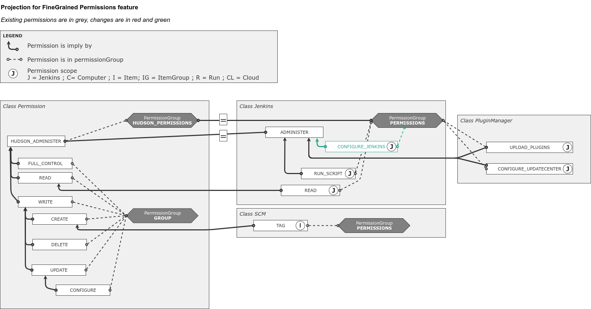
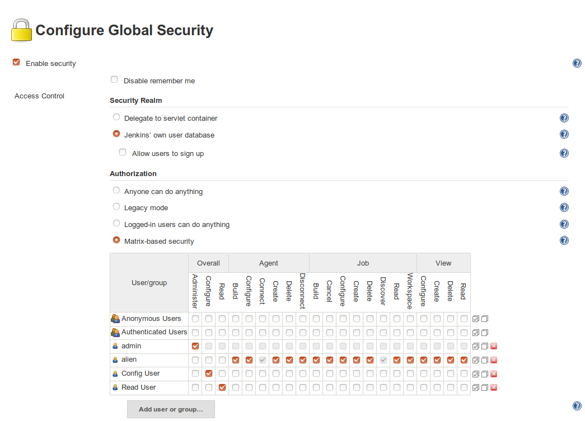
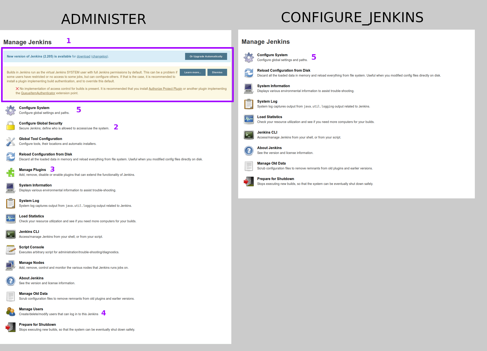
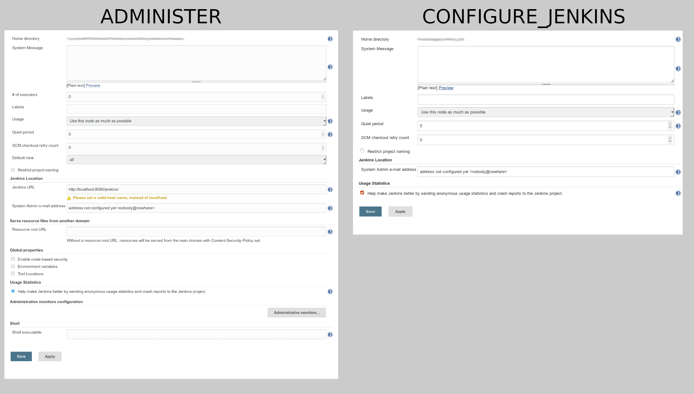

= JEP-0000: Sensible Permissions
:toc: preamble
:toclevels: 3
ifdef::env-github[]
:tip-caption: :bulb:
:note-caption: :information_source:
:important-caption: :heavy_exclamation_mark:
:caution-caption: :fire:
:warning-caption: :warning:
endif::[]

.**JEP Template**
[TIP]
====
In this document, all text in a "Tip" block (or inline text with with a ":bulb:" on either side)
MUST be removed and/or replaced with text appropriate to this JEP before submission.

Sections may include aditional help and advice in comments.
":bulb:" entries in comments only need to be filled in if that text is uncommented.

See https://github.com/jenkinsci/jep/blob/master/jep/1/README.adoc[JEP-1] for full and accurate description of the JEP process and what is required in each section.
====

[TIP]
====
*BDFL-Delegate* is uncommented by default.
As part of the in initial conversation or the JEP submission the sponsor should
look for a BDFL Delegate.
While not required, it is better for the community if Delegates perform most reviews.
If no suitable BDFL-Delegate can be found, that row may be commented out.
====

.Metadata
[cols="1h,1"]
|===
| JEP
| 0000

| Title
| Sensible Permissions

| Sponsor
| link:https://github.com/mikecirioli[Mike Cirioli], link:https://github.com/aHenryJard[Angelique Jard], link:https://github.com/EstherAF[Esther Álvarez Feijoo] 

// Use the script `set-jep-status <jep-number> <status>` to update the status.
| Status
| Not Submitted :information_source:

| Type
| :bulb: Standards :bulb:

| Created
| :bulb: (2019-11-01) :bulb:

| BDFL-Delegate
| TBD

//
//
// Uncomment if there is an associated placeholder JIRA issue.
//| JIRA
//| :bulb: https://issues.jenkins-ci.org/browse/JENKINS-nnnnn[JENKINS-nnnnn] :bulb:
//
//
// Uncomment if discussion will occur in forum other than jenkinsci-dev@ mailing list.
//| Discussions-To
//| :bulb: Link to where discussion and final status announcement will occur :bulb:
//
//
// Uncomment if this JEP depends on one or more other JEPs.
//| Requires
//| :bulb: JEP-NUMBER, JEP-NUMBER... :bulb:
//
//
// Uncomment and fill if this JEP is rendered obsolete by a later JEP
//| Superseded-By
//| :bulb: JEP-NUMBER :bulb:
//
//
// Uncomment when this JEP status is set to Accepted, Rejected or Withdrawn.
//| Resolution
//| :bulb: Link to relevant post in the jenkinsci-dev@ mailing list archives :bulb:

|===

== Abstract

The permission types `Jenkins.RUN_SCRIPTS`, `Jenkins.CONFIGURE_UPDATECENTER`, and `Jenkins.UPLOAD_PLUGINS` provide a false sense of security, as a user is able to escalate this limited privilege to `Jenkins.ADMINISTER`.  These permissions are being marked as `@Deprecated` and are now consolidated as `Jenkins.ADMINISTER`.  

A new permission type, `Jenkins.CONFIGURE` (implied by `Jenkins.ADMINISTER`) has been created for actions that allow for the management of Jenkins configuration items that do not require `Jenkins.ADMINISTER`.  This new permission is used to create a clear separation between settings that impact the entirety of a Jenkins instance (particularly with regards to security) and those that can be used to manage other aspects of an installation. 


== Specification

The following permission types are now marked as `@Deprecated` and `@Restricted(NoExternalUse.class)`:

* `Jenkins.RUN_SCRIPTS`
* `Jenkins.CONFIGURE_UPDATECENTER`
* `Jenkins.UPLOAD_PLUGINS`

This allows for backwards compatiblilty with plugins while providing motivation to refactor any usages of the deprecated checks in future releases.

Methods that formerly checked for these permissions will instead check for `Jenkins.ADMINISTER`.

All other methods that check for `Jenkins.ADMINISTER` will be evaluated to determine if the use of the new `Jenkins.CONFIGURE` permission type is appropriate.  The general rule of thumb is that configuration item which does not let you change the underlying security model (either directly, or through a malicious plugin or groovy script), or change fundamental configurations such as hostnames, proxy configuration, etc. are likely candidates to use the `Jenkins.CONFIGURE`.

Here is a design of the new Permission model. Existing permissions are in Grey and, new deprecations are in Red, and the new permission is in Green.



=== The new UX for Jenkins

The main change for the new `Jenkins.CONFIGURE_JENKINS` permission is on the manage page. 

We used the `Matrix Authorization` plugin to create two users, each one with only one permission: `Jenkins.ADMINISTER` or `Jenkins.CONFIGURE_JENKINS`.



See below how we splitted the permissions between `Jenkins.ADMINISTER` and `Jenkins.CONFIGURE_JENKINS`.



For most of menu item, they are avalaible for both users or only `Jenkins.ADMINISTER` on the whole. It's a full authorize or not for `Jenkins.CONFIGURE_JENKINS`. The only exception is for (4) "Configure System".

By default, all menu in the "/manage" page required `Jenkins.ADMINISTER`, the links that are authorized for `Jenkins.CONFIGURE_JENKINS` are precised one by one. That means that if a plugin adds some ManagementLink, it will have to override `getRequiredPermission()` to return `Jenkins.CONFIGURE_JENKINS`. For exemple :

```java
public class CustomLink extends ManagementLink {

    @Override
    public Permission getRequiredPermission() {
        return Jenkins.CONFIGURE_JENKINS;
    }
}
```
Plugin may have to change also permission on jelly files to allow `Jenkins.CONFIGURE_JENKINS` on management links.

First of all (1), system information messages are only for `Jenkins.ADMINISTER`, it's not showed with `Jenkins.CONFIGURE_JENKINS` because this message can contains some button that can lead to sensible modifications. We choose to not show a subset of safe message, because it can lead to an false feeling of well configured Jenkins to the `Jenkins.CONFIGURE_JENKINS`. Some critical message could be only displayed to `Jenkins.ADMINISTER` and a user with `Jenkins.CONFIGURE_JENKINS` can think that everything is fine because nothing is showed but it's not.

User management and security configuration (2) needs `Jenkins.ADMINISTER` because managing user can allow someone to grant himself to `Jenkins.ADMINISTER` and then do anything on Jenkins.

Plugin management (3) also needs `Jenkins.ADMINISTER` to be configured, because plugin can contains security issue and moreover custom plugin could contain intentionnal backdoor. Some right could be interesting for `Jenkins.CONFIGURE_JENKINS` on plugins, like install plugin only from trusted update center. That kind of feature need more design and more work so we authorize `Jenkins.ADMINISTER` only for this feature.

Configure System (4) is the root need of this feature, so we authorized this menu for `Jenkins.CONFIGURE_JENKINS` filtered items that can be configured by `Jenkins.CONFIGURE_JENKINS`.



`Global properties` and `# of executor` needs ADMINISTER to be modified.
[]
====
proviide more detail about what plugins, etc
====


[]
====
do we need to talk about the matrix auth plugin here as well?  The new permissions are only applicable if using that so i think we should talk about it.
====

== Motivation

[TIP]
====
Explain why the existing code base or process is inadequate to address the problem that the JEP solves.
This section may also contain any historical context such as how things were done before this proposal.

* Do not discuss design choices or alternative designs that were rejected - those belong in the Reasoning section.
====

The current permission model provides a false sense of security for Jenkins administrators.  The motivation was to allow some users the ability to configure limited aspects of a Jenkins instance without granting them full `Jenkins.ADMINISTER` privileges; however, it is trivial for a motivated user to grant themselves the additional privileges by means of the groovy console (`Jenkins.RUN_SCRIPTS`), or by means of a malicious plugin (`Jenkins.UPLOAD_PLUGINS`, `Jenkins.CONFIGURE_UPDATECENTER`).

By consolidating all permission types that effectively allow a user to have full `root` access on a Jenkins instance, and introducing a new permission (`Jenkins.CONFIGURE`) that allows a limited amount of access to configure certain non-critical functionality, a Jenkins administrator can safely delegate configuration aspects while being confident that security concerns are being met.

The `Jenkins.CONFIGURE` permission type is not intended to replace any `Item` level permissions.  It is solely for the purpose of seperating sensistive, security related Jenkins configuration settings from those that a non-root administrator might be expected to manage.

== Reasoning

[TIP]
====
Explain why particular design decisions were made.
Describe alternate designs that were considered and related work. For example, how the feature is supported in other systems.
Provide evidence of consensus within the community and discuss important objections or concerns raised during discussion.

* Use sub-headings to organize this section for ease of readability.
* Do not talk about history or why this needs to be done - that is part of Motivation section.
====

=== Consolidating "dangerous" permissions
The permissions that are considered "dangerous" effectively provide the user with the means to grant themselves the "ultimate" permission, `Jenkins.ADMINISTER`, thereby making their existence redundant.  Consolidating these permissions into `Jenkins.ADMINISTER` removes ambiguity concerning what a user is or is not permitted to do.

=== Deprecating "dangerous" permissions vs. removing them
Due to the large number of plugins available for Jenkins, the decision was made to mark these "dangerous" permissions as `@Deprecated` and `@Restricted(NoExternalUse.class)`.  This will allow for backwards compatibility with existing plugins while minimizing any new usages.  This approach will encourage plugin authors to update their code in future releases that depend upon the new Jenkins Core baseline.


=== Open questions

==== Which permissions should Jenkins.CONFIGURE imply

We have considered which other permissions should be implied by `Jenkins.CONFIGURE`

We are hesitating about `Jenkins.READ` (a.k.a `Overall Read`). 

This permission is required to access the web or use the CLI, and is only implied by `Jenkins.ADMINISTER`, which means that currently any other permission allows to access the web, and it has to be given explicitly.

However, it is reasonable for `Jenkins.CONFIGURE`, as a permission of Jenkins/Overall scope, to imply it.

At the same time, the current implementation of `Permission` makes impossible to make `Jenkins.CONFIGURE` imply `Jenkins.READ`, because a permission can not be implied by more than one, and `Jenkins.READ` is already implied by `Permission.READ`

image::CONFIGURE-and-READ-permissions.svg[]

These are the different solutions we are considering:

. `Jenkins.CONFIGURE` is not enough to access the website. 
	* Pros:
        ** Same behaviour that with any other permission (except `Jenkins.ADMINISTER`)
        ** No changes in currently implemented permission.
	* Cons:
        ** For a user, seems counterintuitive: `Overall Configure` is not enough to access the website, and they will need to also provide `Overall Read`

. Make `Jenkins.CONFIGURE` to imply `Permission.READ`. 
	* Pros:
        ** User doesn’t have to provide “Overall Read” to allow a user with “Overall Configure” to access the website
	* Cons:
        ** Security Risk: `Jenkins.CONFIGURE` would allow to see all jobs, views, and any other item in plugins with READ permission implied by `Permission.READ` (credentials?)
        ** The permission would be less fined grained
        Some users may want to have a role to configure jenkins, but without the ability to see the jobs executed by jenkins, which can give information about private customers or projects.

. Change the places were Jenkins.READ is required, to also allow Jenkins.CONFIGURE:
https://github.com/mikecirioli/jenkins/pull/20
    * Pros:
        ** User doesn’t have to provide “Overall Read” to allow a user with “Overall Configure” to access the website
        ** We can choose in more detail what a `Jenkins.CONFIGURE` allows to see, allowing differences with existent READ permissions
    * Cons:
        ** This would be introducing a new mechanism to enforce authorization that can lead to an implementation even more difficult to understand and maintain.

. Change Permission class, to allow a permission be implied by more than one, and make Jenkins.READ be implied by Jenkins.CONFIGURE.
    * Pros:
        ** User doesn’t have to provide “Overall Read” to allow a user with “Overall Configure” to access the website
        ** This change in Permission class supports implementing more complex permission schema, which can be useful in the future 
    * Cons:
        ** The change can be difficult, specially to avoid breaking compatibility
== Backwards Compatibility

[TIP]
====
Describe any incompatibilities and their severity.
Describe how the JEP proposes to deal with these incompatibilities.

If there are no backwards compatibility concerns, this section may simply say:
There are no backwards compatibility concerns related to this proposal.
====
No existing permission types are being removed at this point, which will allow for existing plugins that make use of them to continue to function.  Removing the "dangerous" permissions is outside the scope of this JEP.

== Security

[TIP]
====
Describe the security impact of this proposal.
Outline what was done to identify and evaluate security issues,
discuss potential security issues and how they are mitigated or prevented,
and detail how the JEP interacts with existing elements in Jenkins, such as permissions, authentication, authorization, etc.

If this proposal will have no impact on security, this section may simply say:
There are no security risks related to this proposal.
====
The intent of this proposal is to improve overall security for Jenkins instances that are using some form of matrix authorization.  All configuration items that require `Jenkins.ADMINISTER` are being reviewed to determine if they can be changed to require the new `Jenkins.CONFIGURE` permission type.  The greatest risk is that some configuration may be _more restrictive_ than necessary, either because it was overlooked or due to differences in opinion during the review process.

== Infrastructure Requirements

There are no new infrastructure requirements related to this proposal.

== Testing

[TIP]
====
If the JEP involves any kind of behavioral change to code
(whether in a Jenkins product or backend infrastructure),
give a summary of how its correctness (and, if applicable, compatibility, security, etc.) can be tested.

In the preferred case that automated tests can be developed to cover all significant changes, simply give a short summary of the nature of these tests.

If some or all of the changes will require human interaction to verify them, explain why automated tests are considered impractical.
Then, summarize what kinds of test cases might be required: user scenarios with action steps and expected outcomes.
Detail whether behavior might be different based on the platform (operating system, servlet container, web browser, etc.)?
Are there foreseeable interactions between different permissible versions of components (Jenkins core, plugins, etc.)?
Does this change require that any special tools, proprietary software, or online service accounts to exercise a related code path (e.g., Active Directory server, GitHub login, etc.)?
When will you complete testing relative to merging code changes, and might retesting be required if other changes are made to this area in the future?

If this proposal requires no testing, this section may simply say:
There are no testing issues related to this proposal.
====
Existing tests that validate permissions, or make assumptions about the permissions being used, will be updated to conform to the new permission model.  Additional tests will be written that validate the new permission type cannot be used when the more restrictive `Jenkins.ADMINISTER` is needed.

== Prototype Implementation

[TIP]
====
Link to any open source reference implementation of code changes for this proposal.
The implementation need not be completed before the JEP is
link:https://github.com/jenkinsci/jep/tree/master/jep/1#accepted[accepted],
but must be completed before any JEP is given
"link:https://github.com/jenkinsci/jep/tree/master/jep/1#final[Final]" status.

JEPs which will not include code changes may omit this section.
====

== References

[TIP]
====
Provide links to any related documents.
This will include links to discussions on the mailing list, pull requests, and meeting notes.
====
TBD: include a list of jenkins issues that are relevant here


