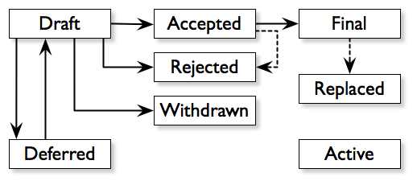

= JEP-1: Jenkins Enhancement Proposal Format
:toc: preamble
:toclevels: 3
ifdef::env-github[]
:tip-caption: :bulb:
:note-caption: :information_source:
:important-caption: :heavy_exclamation_mark:
:caution-caption: :fire:
:warning-caption: :warning:
endif::[]

.Metadata
[cols="2"]
|===
| JEP
| 1

| Title
| Jenkins Enhancement Proposal Format

| Champion
| link:https://github.com/rtyler[R Tyler Croy], link:https://github.com/bitwiseman[Liam Newman], link:https://github.com/oleg-nenashev[Oleg Nenashev]

| Status
| Active :smile:

| Type
| Process

| Created
| 2017-09-12

| Last updated
| May TODO, 2020

|===

[[abstract]]
== Abstract

A Jenkins Enhancement Proposal (JEP) is a design document that
describes a new feature or aspect of Jenkins itself,
or the Jenkins project processes or environment.
This JEP describes the structure of JEP documents
and details the process by which JEPs are
created, submitted, reviewed, finalized, and maintained.

[[specification]]
== Specification

=== What is a JEP?

JEP stands for Jenkins Enhancement Proposal.
A JEP is a design document that
describes a new feature or aspect of Jenkins itself, or Jenkins project, plugin, processes or environment.
A JEP provides a concise technical specification of the feature,
describes the motivation for the change,
and discusses the rationale behind the design.

JEPs are the primary mechanism for proposing major new
features, for collecting community input on an issue, and for
documenting the design decisions that have gone into Jenkins.
Each JEP must have at least one <<Champion>>.
The JEP Champion is responsible for the JEP overall - building
consensus for that JEP within the community, documenting dissenting opinions,
coordinating contributors work, and generally ensuring the JEP
meets the style, format, and quality guidelines described below.
A JEP may also have any number of <<Contributor, Contributors>> who
help write, implement, discussion, or offer feedback about the JEP.
One contributor might do only one or any combination
of these things during any part of the life of a JEP.

Because the JEPs are maintained as text files in a versioned
repository, their revision history is the historical record of the
feature proposal footnoteref:[repo, https://github.com/jenkinsci/jep].

[NOTE]
====
For non-text files added to the repository, such as images, the files must be
readable with free and open source tools, and should ideally be editable by
other contributors. For example, use SVG rather than PSD for vector graphics.
====

=== JEP Types

There are three kinds of JEP:

. A **Standards Track** JEP describes a new feature or implementation
 for Jenkins. It may also describe an interoperability or
 backwards-compatibility standard which will be supported for the feature in
 current versions of Jenkins, moving forward.
. An **Informational** JEP describes a Jenkins design issue, or
 provides general guidelines or information to the Jenkins community,
 but does not propose a new feature. Informational JEPs do not
 necessarily represent a Jenkins community consensus or
 recommendation, so users and implementers are free to ignore
 Informational JEPs or follow their advice.
. A **Process** JEP describes a process surrounding Jenkins, or
 proposes a change to (or an event in) a process. Process JEPs are like
 Standards Track JEPs but apply to areas other than the Jenkins codebase
 itself. They may propose an implementation, but not for what would be
 generally considered the Jenkins codebase; they often require community
 consensus; unlike Informational JEPs, they are more than recommendations, and
 users are typically not free to ignore them. Examples include procedures,
 guidelines, changes to the decision-making process, and changes to the tools
 or environment used in Jenkins development. Any meta-JEP (JEP focusing on the
 improvement of the Jenkins Enhancement Proposal process) is also considered a
 Process JEP.

=== JEP Terminology

==== BDFL

There are several references in this JEP to the "BDFL". This acronym stands for
"link:https://en.wikipedia.org/wiki/Benevolent_dictator_for_life[Benevolent Dictator for Life]".
For the Jenkins project the BDFL is
link:https://github.com/kohsuke[Kohsuke Kawaguchi],
original creator of Jenkins.
In the current version of the proposal, the BDFL role has no special privileges or responsibilities.

NOTE: Before the process changes in May 2021, the BDFL was responsible to review and accept JEPs.
Now the responsibilities of this role are handled by the Jenkins community and driven by the standard decision making process
documented in the link:https://www.jenkins.io/project/governance/[Jenkins Governance Document].

==== Editor

The JEP editors are individuals responsible for managing the administrative
and editorial aspects of the JEP workflow (e.g. assigning JEP numbers and
changing their status). See <<editor-responsibilities, JEP Editor Responsibilities & Workflow>> for
details. The current editors are:

* link:https://github.com/rtyler[R. Tyler Croy]
* link:https://github.com/oleg-nenashev[Oleg Nenashev]
* link:https://github.com/bitwiseman[Liam Newman]
* link:https://github.com/omehegan[Owen Mehegan]
* link:https://github.com/orrc[Christopher Orr]

JEP editorship is by invitation of the current editors. All of the JEP workflow
can be conducted via the GitHub JEP Repository footnoteref:[repo] and pull
requests.

==== Contributor

A JEP may have any number of "Contributors" who
help write, implement, discuss, or offer feedback about that JEP.
One contributor might do only one or any combination of these
of these things during any part of the life of a JEP.
While we invite contributions by companies or other organizations, contributors listed in a JEP
(such as Champions or Advisors below) need to be specific people.
The final decision may be made by a group of contributors,
e.g. by the Jenkins community or another community entity.

==== Jenkins community

The _Jenkins community_ term represents all community members,
regardless of the degree to which they contribute to a particular JEP.
The Jenkins community consists of anyone who contributes to improving the Jenkins or the Jenkins community.
The community is not a single homogenous entity, but rather a group of individuals with a common interest.  
The community makes decisions on most topics including JEPs based on the general consensus of all interested members of the Jenkins community following the philosophy defined in the
link:https://www.jenkins.io/project/governance[Jenkins Governance Document] and the
link:https://www.jenkins.io/project/conduct[Jenkins Code of Conduct].
As long as a consensus can be reached,
accepting or rejecting a JEP is considered a community decision.
The Jenkins community may choose to delegate the decision to another community entity such as the members of a SIG or even to one individual, 
hence the "<<Reviewer>>" term is used for the review process.

==== Champion

Each JEP has at least one "Champion".
The JEP Champion is a contributor who is responsible for the JEP throughout its lifecycle.
Their responsibilities include:

* Building consensus for that JEP within the community
* Documenting dissenting opinions
* Coordinating contributors' work
* Ensuring the JEP meets the style, format, and quality guidelines
* Maintaining the JEP after it is finalized
* Setting and communicating the schedule as needed

The Champion of a JEP may or may not do any of the tasks other contributors do.
For example, one champion might write large portions of one JEP,
while another champion might leave the writing to other contributors.

Anyone may be Champion for a JEP,
though it should be someone familiar enough with Jenkins, the Jenkins project,
and the JEP workflow to effectively guide the JEP to completion.

A JEP may have more than one Champion, especially after it has been finalized
and is being maintained over time.
For simplicity, this document uses the singular
("The JEP Champion", "a champion")
when referring the one or more people in the role of "Champion" of a JEP.

Champions may have committer/write access on the JEP repository, but should
only approve and merge pull requests for JEPs to which they are assigned.

==== Advisor

An Advisor is an experienced contributor who helps the <<Champion>> understand and work through the JEP process, ensuring that there is enough public discussion and a consensus built around accepting the JEP,
and that the decision making process is followed. 
Having an Advisor for a JEP is optional, usually only needed when a less experienced contributor submits a JEP and becomes a JEP champion.
JEP Advisor may or may not participate in the reviews and implementation of the JEP.

Anyone may be Advisor for a JEP,
though it should be someone familiar enough either with the subject matter, the Jenkins project,
and the JEP workflow to effectively guide the JEP to completion.

A JEP may have more than one Advisor.
There might be no JEP advisor for JEPs submitted by experienced contributors
who are familiar with the Jenkins community and the JEP workflow.
For simplicity, this document uses the singular form.

==== Reviewer

The JEP Reviewer is a community entity or an individual contributor that reviews the JEP and makes an acceptance decision.
By default this role is not specified, making review and acceptance of a JEP the responsibility of any interested members of the <<Jenkins community>> with consensus of being sufficient for acceptance.  
The community may choose to delegate the role of Reviewer to another community entity or individual contributor. 
This delegation will be made only based on consensus of any interested members including the intended Reviewer.  
Delegation may be revoked only with the consensus of any interested members aside from the currently assigned reviewer. 
A Reviewer may decline or resign from the role but cannot assign or delegate it to anyone else.

=== Deprecated terms

There are terms which were used in previous editions of the JEP,
but they are no longer applied in the modern version of the process.
The terms are listed here for historical reference reasons.

==== Sponsor

The term is replaced by <<Champion>>.

==== BDFL Delegate

A deprecated term which was used before the changes in May 2021.
The <<BDFL>> was able delegate their review and decision making responsibilities to another contributor,
a "BDFL Delegate" on a per-JEP basis.
The BDFL Delegate for a JEP had all the responsibilities of the BDFL within the context of that JEP,
except delegating their role.

[[requirement-levels]]
==== Must/Should/May

JEP documents _must_ follow link:https://tools.ietf.org/html/rfc2119[RFC 2119]
which defines key words to "indicate requirement levels". These are listed
below:

. **MUST** This word, or the terms "REQUIRED" or "SHALL", mean that the
   definition is an absolute requirement of the specification.
. **MUST NOT** This phrase, or the phrase "SHALL NOT", mean that the
   definition is an absolute prohibition of the specification.
. **SHOULD** This word, or the adjective "RECOMMENDED", mean that there
   may exist valid reasons in particular circumstances to ignore a
   particular item, but the full implications must be understood and
   carefully weighed before choosing a different course.
. **SHOULD NOT** This phrase, or the phrase "NOT RECOMMENDED" mean that
   there may exist valid reasons in particular circumstances when the
   particular behavior is acceptable or even useful, but the full
   implications should be understood and the case carefully weighed
   before implementing any behavior described with this label.
. **MAY** This word, or the adjective "OPTIONAL", mean that an item is
   truly optional.

NOTE: When choosing to go counter to SHOULD or SHOULD NOT guidance,
the reasons behind that choice SHOULD be documented.

=== JEP Workflow

==== Overview

Before delving into the details of the JEP workflow,
let's take a high-level look at how JEP might go.

. **<<start, Initial Discussion>>** - Andrea has an idea for new feature and emails it jenkinsci-dev@googlegroups.com.
  She discusses the idea with the group, determining that the idea is worth pursuing.
  She chooses to be the "<<Champion>>" for this potential JEP.
  She <<discussion, gathers initial feedback>> from the community, adjusts her design as needed,
  records the reasons for design choices, and keeps track of differing views.
  This is Andrea's first JEP. Juan, an experienced contributor, volunteers to be Andrea's <<Advisor>> for this JEP.

. **<<submission, Submission>>** - Andrea writes up the proposal using the JEP document template as a guide.
  She includes supporting documentation
  and a minimal prototype implementation sufficient to convey the viability of the design.
  She submits the JEP to the <<editor, JEP editors>> for
  <<approval, approval as a Draft JEP>>.
  One of the editors checks the submission and determines it is ready to considered as a JEP.
  They "approve" the submission, assigning the JEP a number,
  and the submission becomes a "<<draft, Draft>>" JEP.

. **<<draft, Draft Status>>** - While the JEP is a "<<draft, Draft>>", Andrea continues to gather
  feedback, change the proposal, and record the reasoning and differing views.
  At the same time, she and other contributors continue expanding and refining
  the prototype implementation as needed to match the current state of the JEP.
  When Andrea believes the JEP is stable,
  addresses all major design and scope questions,
  and represents the consensus of the community,
  she then asks the <<Jenkins community>> to review the JEP for Acceptance.
  This happens in the main Jenkins developer list,
  and the message should reference the JEP discussion channel.

. **<<review, Review>>** - any interested members of <<Jenkins community>> review the JEP
  and any related discussions and implementation. 
  Alternatively, if the <<Reviewer>> role had been delegated to another entity then they would also perform a review. 
  All Reviewers agree with Andrea that consensus has been reached regarding the JEP
  and that the implementation is far enough along to enusure that
  the design is stable and complete.
  This decision is made in a publicly traceable form.
  Andrea announces the decision in the discussion channel defined for the JEP,
  and explicitly sets the final response timeout (see <<accepted>>),
  e.g. by saying "this JEP might be accepted in 7 calendar days unless there is unaddressed negative feedback".
  The champion submits a pull request that marks the JEP as an "<<accepted, Accepted>>" JEP.
  

. **<<accepted, Accepted Status>>** -
  If there is no new feedback before the deadline, a JEP Editor merges the status update pull request.
  Andrea and other contributors
  complete all remaining implementation related to the
  "<<accepted, Accepted>>" JEP (code, documentation, or other changes).

. **<<final, Final Status>>** - When the implementation is complete
  and all changes have been published
  or otherwise incorporated into the appropriate code repositories,
  the JEP status is changed to "<<final, Final>>"
  (or in some cases "<<active, Active>>").
  The JEP is done.

. **<<maintenance, Maintenance>>** - At some later date,
  the JEP may need to be updated with minor changes and clarifications.
  As <<Champion>> of the JEP, Andrea makes changes as needed or hands off the role to someone else.
  Updates follow the same basic JEP workflow.
  For extensive changes or additions,
  Andrea will start a whole new JEP instead of updating the original JEP.
  This new JEP might expand on the orginal or might <<replaced, replace>> it.

. **<<Other JEP Outcomes, Other Outcomes>>** - Not all JEPs will be accepted and finalized.
  Other possible outcomes include "<<rejected, Rejected>>",
  "<<deferred, Deferred>>", "<<withdrawn, Withdrawn>>".

IMPORTANT: The above is only a high-level overview of the JEP workflow.
The full and complete description of the JEP workflow is provided below.
Read the full description below before starting a JEP.

[[start]]
==== Start with an idea for Jenkins

The JEP process begins with a new idea for Jenkins.
A single JEP should contain a single key proposal or new idea.
The more focused the JEP, the more successful it tends to be.
The JEP editors reserve the right to reject potential JEPs
if they appear too unfocused or too broad.
If in doubt, champions should split their JEP into several well-focused ones.

[NOTE]
====
Enhancements or patches which have a smaller impact often don’t need a JEP.
These can be handled via the regular Jenkins development workflow with a JIRA issue and/or pull request to the appropriate repository.

A JEP may still have an accompanying JIRA issue as a placeholder.
This might be useful, for example, if implementation of the JEP is later found to have introduced a bug;
being able to link the `regression`-labelled JIRA issue to the placeholder is valuable for tracking purposes.
In such a case be sure to specify a "<<header-jira, JIRA>>" section.
====

==== Find a Champion

Each JEP must have a "<<Champion>>" -- someone who writes the JEP using the style and
format described below, shepherds the discussions in the appropriate forums,
and attempts to build community consensus around the idea.
The JEP Champion should first attempt to ascertain whether the idea is JEP-able.
Posting to the jenkinsci-dev@googlegroups.com mailing list is the best way to
go about this.

[[discussion]]
==== Discuss the idea with the community

Vetting an idea publicly before going as far as writing a JEP is meant
to save the potential champion time. Many ideas have been brought
forward for changing Jenkins that have been rejected for various
reasons. Asking the Jenkins community first if an idea is original
helps prevent too much time being spent on something that is
guaranteed to be rejected based on prior discussions (searching
the internet does not always do the trick). It also helps to make sure
the idea is applicable to the entire community and not just the champion. Just
because an idea sounds good to the champion does not mean it will work for most
people in most areas where Jenkins is used.

Once the champion has asked the Jenkins community whether an idea has any
chance of acceptance, a "pre-Draft" JEP should be presented to jenkinsci-dev@googlegroups.com.
This gives the champion a chance to flesh out the JEP to make sure it is
properly formatted, of high quality, and to address initial concerns about the
proposal.

Even for "pre-Draft" discussion, the champion may find it convient to follow the
<<submission, JEP Submission>> steps below, including creating a PR,
but state in PR comments that they not yet ready to submit the JEP.
This allows them to use the PR request tools for discussion and modification right away,
and sets them up for a smooth submission process.
In this case, the champion only needs to notify `@jenkinsci/jep-editors` when they are ready to
submit the JEP for <<approval, approval as Draft>>.

[[submission]]
==== Creating a JEP Submission

Following a discussion on jenkinsci-dev@googlegroups.com,
the proposal should be turned into as a JEP submission and submitted
via a GitHub pull request to this repository footnoteref:[repo].

IMPORTANT: All submissions must go through pull request,
even those by editors or contributors with "git push" privileges
for the JEP repository footnoteref:[repo].

To submit a JEP for <<approval, approval as Draft>>, the JEP champion should:

. Fork the JEP repository footnoteref:[repo].
. Clone their forked repository locally.
. Create a new branch called `jep-submission` in their clone
  (`git checkout -b jep-submission`).
  If there is already a JEP being submitted from this fork,
  they may uniquify the branch name; for example, `jep-submission-JENKINS-nnnnn`.
. Copy the folder `jep-template/0000` to `jep/0000`.
. Modify the template JEP in `jep/0000`
  per the instructions in this JEP (which are also outlined in the template).
. Commit and push the changes to their fork
  and submit a pull request targeting the `jenkinsci/master` branch.
. Add the following line to the description of the PR to indicate that the JEP
  is being submitted for approval as draft:
  "Submitted for approval as draft JEP by `@jenkinsci/jep-editors`."
  If this is a PR that was created earlier to gather feedback,
  the line requesting approval should be added as a comment when the JEP is ready.

The champion may alter the steps above or do something else entirely
as long the result is a PR with a submission in the appropriate format
with a comment asking for approval as draft.

[[approval]]
==== Approval as Draft JEP

A JEP editor will check the submission for conformance with
JEP structure and formatting guidelines.
Editors may make minor changes to make the submission meet
the requirements for approval as a Draft JEP.
If a JEP requires major changes, editors will add specific feedback
and send the submission back to the champion for revision.

IMPORTANT: "Approval as Draft" is *not* the same as <<accepted, accepting the JEP>>.
"Approval as Draft" is an initial conformance and viability check.
When a champion submits a JEP for approval, Editors and contributors
should restrict their feedback to issues which would cause the JEP
to be denied <<draft, Draft>> status.
This keeps the approval process from bogging down in details that are outside
the scope of evaluating whether a JEP is ready for "Draft" status.

The JEP editors will not unreasonably deny a JEP "Draft" status.
Reasons for denying JEP "Draft" status include:

* duplication of effort
* being technically unsound
* not providing enough information in all <<Required Sections>>
  ("Motivation", "Backwards Compatibility", etc)
* not in keeping with the link:https://jenkins.io/project/governance/[Jenkins philosophy].

The <<Reviewer>> for this JEP may be consulted during the approval phase,
and is the final arbiter of a submission's approvability as a Draft JEP.

Once JEP meets requirements for structure and formatting,
the editors will approve the submission as a draft JEP
by following the steps outlined in the
<<approve-as-draft, editors' "Approve as Draft" section>>.
When they are done, the Draft JEP will have an official JEP number and
the submission PR will have been merged to a matching folder
(for example,
`link:https://github.com/jenkinsci/jep/tree/master/jep/1[jep/1]`)
in the `master` branch.

Editors are not the only ones who can approve a submission.
Non-editor contributors who have "git push" privileges for the
JEP repository footnoteref:[repo] may also approve submissions.
When doing so, that contributor must handle the tasks
that would normally be taken care of by the JEP editors
(see <<editor-responsibilities, JEP Editor Responsibilities & Workflow>>).
This includes ensuring the initial version meets the expected standards
for a Draft JEP.

[[draft]]
==== Refining a Draft JEP

The version of a JEP that is approved as a Draft JEP
is rarely the same as the final version that is reviewed and hopefully accepted.
A Draft JEP often requires further refinement and expansion
before it is sufficiently complete and represents the consensus of the community.

Standards Track JEPs consist of two parts, a design document
and a prototype implementation.
The prototype implementation should be co-developed with the JEP,
as ideas that sound good in principle sometimes turn out to be impractical
when subjected to the test of implementation.

A JEP's champion is responsible for collecting community feedback on a JEP
before submitting it for review.
Potential changes to a draft JEP may be discussed further on jenkinsci-dev@googlegroups.com.
However, long open-ended discussions are not recommended on mailing lists.
Strategies to keep the discussion efficient include:

* setting up a series of in-person, or video-conferencing sessions to
  discuss the JEP with necessary stakeholders.
* having the JEP champion accept private comments in the early design phases
* setting up a wiki page, etc.
* committing and reviewing small concrete changes via Pull Requests
  rather than large sweeping changes

JEP champion should use their discretion here.

The JEP champion may also ask JEP editors for further feedback regarding the
style and consistency of a JEP and its readiness for review.

As updates are necessary, the JEP champion and other contributors
should push commits to their fork of the JEP repository footnoteref:[repo],
and submit pull requests targeting the `master` branch.

[[review]]
==== JEP Review

Once the champion believes a JEP meets at least the minimum criteria to be "<<Accepted, Accepted>>",
they request the JEP be reviewed for acceptance, usually via
an email to the jenkinsci-dev@googlegroups.com mailing list.
The JEP <<Reviewer>> and their chosen consultants then review the JEP.
If the Reviewer agrees that JEP is ready, they mark the JEP as "<<Accepted, Accepted>>".
If they do not agree, they leave the JEP as a "Draft", awaiting further revision.
In either case, the reviewer must send a detailed response
to the jenkinsci-dev@googlegroups.com mailing list explaining their decision.

JEP review and resolution may also occur on a list other than jenkinsci-dev@googlegroups.com.
In this case, the "Discussions-To" header in the JEP will identify the
appropriate alternative list where discussion, review and pronouncement on the
JEP will occur.

[[accepted]]
==== Accepting a JEP

For a JEP to be "Accepted" it must meet certain minimum criteria.
It must:

* provide a net improvement.
* represent the consensus of the community,
  including documentation of dissenting opions.
* clearly define the scope and features of the proposed enhancement.
* describe a completed design that addesses any major design questions.

For JEPs that include implementation based on the proposal,
the implementation must meet certain minimum criteria.
It must:

* be solid and have progressed enough to resolve major design or scope questions.
* not complicate Jenkins unduly.
* have the same license as the component the
  proposal is meant to be added to (or MIT licensed by default).

By marking a JEP as "Accepted" the champion indicates they believe that the JEP has
clear scope, design completeness, community consensus, and (if applicable) in-progress implementation.
Without all of these a JEP cannot be accepted.
For this reason, it is not unusual for JEPs to remain in "Draft" state
even after they have strong community support and progressing implementation.
They must still pass the other criteria, such as scoping and design completeness.

Before accepting the JEP, an explicit JEP readiness notification must be sent by a champion to the discussion channel defined for the JEP.
This message should explicitly declare that the JEP is ready to be accepted and that it may be merged
if there is no unaddressed negative feedback within a period of at least **7 calendar days**.
The <<Reviewer>> may define a longer period final review period if needed.
If there is a negative feedback which needs substantial changes in the JEP,
the countdown should be reset.

Once a JEP has been accepted, the implementation must continue to progress
and eventually be completed.
The Jenkins project values contribution over "talk"
footnote:[https://jenkins.io/project/governance/#meritocracy], and as such the
implementation is of utmost importance to moving any proposal (Standards or
Process) forward.

Ideally, all changes to a JEP should be completed before it is "Accepted",
but surprises may still occur.  Changes might be minor changes,
such as clarifications or typo fixes, or major changes,
which would alter the intent, scope, API, or core behavior of the JEP.

All changes to an already "Accepted" JEP, must be submitted via PR as usual.
In the case of major changes,
the Champion should also communicate those changes on the mailing list
and take sufficient time to ensure there is consensus on the changes before merging them.
A link to any discussion should be added to the PR for the change
and to the <<Required Sections, References>> section.
If there are significant objections or questions around proposed changes,
the JEP Champion or Reviewer may choose to return the JEP to a "Draft" status
for more extensive discussion and eventual <<review, review again for acceptance>>.

[[final]]
==== Finalizing a JEP
When the implementation is complete and incorporated into the
appropriate "main" code repository, the JEP champion will change
the JEP's status changed to "Final".

Active:: [[active]]
Some Informational and Process JEPs may have a status of "Active" instead of "Final"
These JEPs are ongoing and never meant to be completed per se. E.g. JEP 1 (this JEP).

[[maintenance]]
==== JEP Maintenance

Even after a JEP reaches "Final" status, it may need to be updated.

In general, Standards track JEPs are not modified after they have
reached the Final state. Once a Standards JEP has been completed, Jenkins developer
documentation must become the formal documentation of the expected behavior.

Informational and Process JEPs may be updated over time to reflect changes
to development practices and other details. The precise process followed in
these cases will depend on the nature and purpose of the JEP being updated.

Replaced:: [[replaced]]
Final JEPs may eventually also be "Replaced" - superseded by a different JEP -
rendering the original obsolete.
This is intended for Informational JEPs, where version 2 of an API can replace version 1.
When a JEP is marked as replaced, the <<header-superseded-by, Superseded-by>> header
must be filled in with a link to the new JEP.

==== Other JEP Outcomes

Not all JEPs will be accepted and finalized.

Rejected:: [[rejected]]
A JEP <<Reviewer>> may choose to reject a JEP.
Perhaps after all is said and done it was not a good idea
or perhaps a competing proposal is a better alternative.
It is still important to have a record of this fact.
+
Rejecting a JEP is a very strong statement.
If the reviewer believes the JEP might eventually be accepted with sufficient modification,
the reviewer will not reject the JEP.
If a reviewer is confident JEP will never be accepted,
they should inform the JEP champion as soon as possible to prevent wasted effort.
On the other hand, even an <<accepted, Accepted>> JEP may ultimately be rejected
at some point before it reaches "<<final, Final>>" status,
due to factors not known at the time it was Accepted.
+
Upon the request of the champion, the reviewer may choose to return a
Rejected JEP to Draft status, but this is at the discretion of the reviewer.

Withdrawn:: [[withdrawn]]
A JEP <<Champion>> may choose to withdraw a JEP.
Similar to "Rejected", "Withdrawn" means that the JEP champion
themselves has decided that the JEP is actually a bad idea,
or agrees that a competing proposal is a better alternative.

Deferred:: [[deferred]]
A JEP can also be assigned a status of "Deferred". The JEP champion or an
editor can assign the JEP this status when no progress is being made
on the JEP. Once a JEP is deferred, a JEP editor can re-assign it
to draft status.

==== Updating JEP Status and Resolution

Whenever a JEP status changes, the "Status" field in the JEP document must be updated.

The possible paths of a JEP's status are as follows:

.JEP Workflow

When a JEP is Accepted, Rejected or Withdrawn,
a "<<header-resolution, Resolution>>" section must be added to the JEP Header
with a link to the relevant post in the jenkinsci-dev@googlegroups.com mailing list archives.

==== Scheduling and timeframes

This workflow does not dictate specific time frames for any actions.
In general, it is expected that a JEP should make reasonable progress over time,
and all involved should respond in everyone can agree is timely manner.
If it becomes necessary to set specific timeframes for action,
it is the Champion's responsibility to do so.
Just as the Champion must build consensus for a JEP,
they must also set and communicate a reasonable schedule to keep a JEP moving forward.
If one or more contributors are not responding
and the Champion chooses to move forward without their feedback,
they should document that choice in the "<<Reasoning>>" section of the JEP.

For decisions made by the <<Jenkins Community>>,
see the timeframes in the link:https://www.jenkins.io/project/governance[Jenkins Governance Document].

==== Resolving Disputes

Except for decisions by a JEP's <<Reviewer>>,
the JEP process is run by
link:https://en.wikipedia.org/wiki/Consensus_decision-making[consensus].
It is the responsibility of every contributor to respect other contributors,
listen to their perspectives, and attempt to find solutions that work for everyone.
The link:https://www.jenkins.io/project/conduct/[Jenkins Code of Conduct] applies
to all sides and to all aspects of the JEP process.

If consensus cannot be achieved on a JEP,
contributors may request that the <<reviewer, JEP Reviewer>> intervene.
The reviewer will consider the matter, and render their decision,
including describing what actions will be taken and documenting their reasoning.

If contributors believe a decision made by the <<Reviewer>> runs counter to the best interests to Jenkins project,
they may request the <<Jenkins community>> to review the decision.
Also, they may do in the case of the  the overall JEP process disputes (rather than one specific JEP).
The community or, if needed, the Jenkins Governance Board,
will take up the matter and render a decision within a reasonable timeframe.
Similar to the judiciary, the community will _not_ make technical decisions,
they will only affirm or reject the Reviewer's decision.
If they affirm, the matter is closed.
If they reject, the <<Reviewer>> will render a new decision taking into account the input.
If deemed necessary, the <<Jenkins community>> may assign another Reviewer.

=== JEP Guidelines

==== Required Sections

All JEPs MUST have the following parts to be "approved as Draft":

. **Metadata** - table containing the <<metadata, JEP Header Preamble>> about the JEP,
  including the JEP number, a short descriptive title, the names,
  and optionally the contact info for each champion, etc.
. **Abstract** - short (200 word) description of the technical issue
  being addressed.
. **Specification** - The technical specification should describe the
  syntax and semantics of any new feature. The specification should be
  sufficiently detailed to allow new or existing Jenkins developers to
  reasonably understand the scope/impact of an implementation.
. **Motivation** - A clear description of the motivation is critical for any JEP
  that wants to change Jenkins or the Jenkins project.
  The motivation section should clearly explain why the existing
  code base or process is inadequate to address the problem that the JEP solves.
  A JEP submission without sufficient discussion of its motivation
  will not be approved as a JEP Draft.
. **Reasoning** - The reasoning describes why particular design decisions were made.
  It should describe alternate designs that were considered and related work,
  e.g. how the feature is supported in other systems.
+
The reasoning section provides evidence of consensus within the
community and describes important objections or concerns raised
during discussion.

. **Backwards Compatibility** - All JEPs must include a section describing
  any incompatibilities and their severity.
  The JEP must explain how it proposes to deal with these incompatibilities.
  If there are no backwards compatibility concerns, the section must say that.
. **Security** - All JEPs must include a section describing their security impact.
  This includes outlining what was done to identify and evaluate security issues,
  discussion of potential security issues and how they are mitigated or prevented,
  and how the JEP interacts with existing permissions, authentication, authorization, etc.
  If the JEP has no impact on security, the section must say that.
. **Infrastructure Requirements** -
  All JEPs must include a section describing their impact on
  Jenkins project infrastructure,
  including additions or changes, interactions with exiting components,
  potential instabilities, service-level agreements,
  and assigning responsibility for continuing maintenance.
  Each JEP must explain the scope of infrastructure changes with sufficient detail
  to allow initial and on-going cost (in both time and money) to be estimated.
  If the JEP has no impact on infrastructure, the section must say that.
. **Testing** -
  All JEPs which include code changes must include a section summarizing how the
  changes will be tested. The JEP itself need not include a complete test
  plan—this could be developed concurrently with the rest of the
  implementation—but it should set out expectations for testability. If the JEP
  has no testing needs, the section must say that.
. **Prototype Implementation** --
  If a JEP will include code changes,
  this section will provide links to a an open source prototype implementation of those changes.
  The prototype implementation must be present for a JEP to be approved as <<draft>>.
  The prototype implementation must be sufficient to convey the viability of the design
  for a JEP to be <<accepted>>.
  While there is merit to the approach of reaching consensus on the
  specification and reasoning before writing code,
  the principle of "rough consensus and running code" is still useful
  when it comes to resolving many discussions of API details.
  JEPs which will not include code changes may omit this section.
. **References** -- When moving a JEP from a Draft to "Accepted" or "Final" state,
  the references section must be updated to include links to the pull requests
  and mailing list discussions which were involved in the process. The JEP
  should self-document the process in which it was developed.

WARNING: JEP submissions that do not adequately complete any of the above sections
will not be approved as JEP Drafts.

The final implementation must include test code and documentation
appropriate for either the Jenkins user or developer documentation.

==== JEP File Format

JEPs are UTF-8 encoded text files using the
link:https://asciidoctor.org[AsciiDoc] format.
AsciiDoc allows for rich markup that is still quite easy to read,
but also results in good-looking and functional HTML.

[[metadata]]
==== JEP Header Preamble

===== Required Metadata

All JEPs MUST begin with an AsciiDoc table containing metadata relevant to the
JEP:

[source,asciidoc]
----
.Metadata
[cols="2"]
|===
| JEP
| 1

| Title
| Jenkins Enhancement Proposal Format

| Champion
| link:https://github.com/rtyler[R Tyler Croy], link:https://github.com/bitwiseman[Liam Newman],

| Status
| Draft :speech_balloon:

| Type
| Process

| Created
| 2017-09-12
|===
----

. **JEP** -- Proposal number, given by the JEP editors. Use "0000" until one is assigned.
. **Title** -- Brief title explaining the proposal in fewer than 50 characters
. **Champion** -- <<Champion>> of the JEP, in essence, the individual
  responsible for seeing the JEP through the process.
. **Status** -- Draft :speech_balloon:, Deferred :hourglass:, Accepted :ok_hand:,
  Rejected :no_entry:, Withdrawn :hand:, Final :lock:, Replaced :dagger:, Active :smile:.
. **Type** -- Describes the type of JEP: Standards, Informational, Process
. **Created** -- Date (`%Y-%m-%d`) when the document was first created.

=====  Additional Header Rows

JIRA:: [[header-jira]]
A **JIRA** row is available to specify a linked placeholder JIRA issue, if any.

Advisor:: [[header-advisor]]
An **<<Advisor>>** row records who acts as advisor in this JEP.
If the row is not included, there is no advisor.

Reviewer:: [[header-delegate]]
A **<<Reviewer>>** row records who will make the final decision to approve or reject a JEP.
If this row is not included, the decision will be made based on the consensus of the <<Jenkins community>>.

Discussions-To:: [[header-discussions-to]]
For a JEP where final pronouncement will be made on a list other than
jenkinsci-dev@googlegroups.com, a **Discussions-To** row will indicate the mailing list
or URL where the pronouncement will occur. A temporary Discussions-To header
may also be used when a draft JEP is being discussed prior to submission for
pronouncement.

Requires:: [[header-requires]]
JEPs may have a **Requires** row, indicating the JEP numbers that this
JEP depends on.

Superseded-By:: [[header-superseded-by]]
JEPs may also have a **Superseded-By** row indicating that a JEP has been
rendered obsolete by a later document; the value is the number of the JEP that
replaces the current document. The newer JEP must have a **Replaces** row
containing the number of the JEP that it rendered obsolete.

Resolution:: [[header-resolution]]
A **Resolution** section will be added to JEPs when their status is set to
Accepted, Rejected or Withdrawn.
It will include a link to the relevant post in the
jenkinsci-dev@googlegroups.com mailing list archives.

==== Auxiliary Files

JEPs may include auxiliary files such as diagrams. Such files must be
named appropriately, with lowercase letters and no spaces, and be included in
the directory with the `README.adoc` describing the JEP.

=== Reporting JEP Bugs, or Submitting JEP Updates

The process for reporting a bug or submitting a JEP update depends on several factors,
such as the maturity of the JEP, the preferences of the JEP champion, and the nature
of the comments. For the early draft stages of the JEP, it's probably best to
send  comments and changes directly to the JEP champion. For more mature, or
finished JEPs consider submitting corrections to the JEP repository
footnoteref:[repo] or the Jenkins issue tracker
footnoteref:[issues,https://issues.jenkins-ci.org].  If the JEP champion is a
Jenkins developer, assign the bug/patch to them, otherwise assign it to a JEP
editor.

When in doubt about where to send changes, please check first
with the JEP champion and/or a JEP editor.

Even JEP champions with git push privileges for the JEP repository should submit
via Pull Request, with the exception of status or resolution updates
which may be pushed directly given the change was already discussed
and agreed to elsewhere.

[[transferring]]
=== Transferring JEP Champion role

It occasionally becomes necessary to transfer the role to a
new champion. In general, it is preferable to retain the original champion as
a co-champion of the transferred JEP, but that's really up to the
original champion. A good reason to transferthe role is because the
original champion no longer has the time or interest in updating it or
following through with the JEP process, or has fallen off the face of
the 'net (i.e. is unreachable or not responding to email). A bad
reason to transfer the role is because the champion doesn't agree with the
direction of the JEP. One aim of the JEP process is to try to build
consensus around a JEP, but if that's not possible, a champion can always
submit a competing JEP.

Ownership of a JEP may also be assumed via pull request.
Fork the JEP repository, footnoteref:[repo] make the champion
modification, and submit a pull request. At the same time, send a message asking
to take over, addressed to both the original champion and the JEP editors via
jenkinsci-dev@googlegroups.com.  If the original champion doesn't respond to email in a timely
manner, the JEP editors will make a unilateral decision (it's not like such
decisions can't be reversed :).

[[editor-responsibilities]]
=== JEP Editor Responsibilities & Workflow

A JEP editor must subscribe to the jenkinsci-dev@googlegroups.com list and must
watch the JEP repository footnoteref:[repo]. Most correspondence regarding JEP
administration can be handled through GitHub issues and pull requests.

Aside from the editorial cases outlined below, editors should submit all changes
as GitHub pull requests (the same as any other contributor).

IMPORTANT: JEP editors don't pass judgment on JEPs. They merely do the
administrative & editorial part (which is generally a low volume task).

==== Conformance check

For each new JEP submission, an editor will:

* Read the JEP to check if it is ready, sound, and complete. The ideas
 must make technical sense, even if they don't seem likely to be
 accepted.

* The title should accurately describe the content.

* Edit the JEP for minor non-controversial language
(spelling, grammar, sentence structure, etc.), markup, code style changes.
For significant or time consuming changes,
the editor may choose to provide feedback instead.

==== Request Changes

If the JEP isn't ready, an editor will send it back to the champion for
revision with specific instructions.

==== Approve as Draft

Once the JEP is ready for the repository, a JEP editor will:

. Assign a JEP number (almost always just the next available number, but
  may also be a special/joke number, like 666 or 3141).
. Update the folder number to match the JEP number
. Update the JEP number in the document.
. Update the JEP status using the `./set-jep-status <JEP number> draft` command (script is located in the root)
. Commit all changes and push them to the branch in the PR
. "Squash and merge" the PR into the `master` branch.

==== Permission group membership

Editors add and remove Champions and Advisors
from the appropriate permission groups on the JEP repository.
When a JEP includes a new Champion or Advisor an editor may add that
person to the "JEP Champions" or "JEP Advisor" GitHub group respectively.
When someone is no longer an active Champion or Advisor,
a JEP editor will remove them from the permission group.  
Editors will clean up the the permission groups from time to time 
as they see the need or are asked to do so.

== Motivation

Jenkins has classically been driven by "you-had-to-be-there" development. With
specific changes largely being driven by smaller independent groups of
developers (sometimes just one).

Design documents extending back into the history of Jenkins are few and far
between, as the project grew organically over time. As such, a contributor,
existing or future, must read mountains of code, pull requests, mailing list
discussions, etc, in order to fully understand how/what/why for many major
subsystems within Jenkins.

Additionally, Jenkins has no formal approach to discussing and reviewing larger
changes as evidenced by many of the Jenkins 2.0 mailing list threads
footnote:[https://groups.google.com/d/msg/jenkinsci-dev/vbXK7JJekFw/BlEvO0UxBgAJ],
which ballooned into threads with 100+ replies and sufficient chaos to be very
difficult for those who weren't full-time Jenkins developers to understand.

The Jenkins Enhancement Proposal aims to address both of these major issues by
providing an understood process for making sizable, but understandable,
enhancements to Jenkins.

=== Benefits to existing developers

JEP provides a systematic approach for vetting and developing new proposals and
ideas for Jenkins. By encouraging "everybody to follow the rules" it will be
easier for existing developers to get their ideas and changes into Jenkins
without finding themselves mired in unspoken cultural norms within the project.

=== Benefits to future developers

By providing clear, understandable, and bite-sized design documents which would
explain various subsections of Jenkins. JEPs also make it clearer how an
ambitious new developer to the Jenkins project can propose, and make progress
upon, a new idea they have for Jenkins.

Overall, less chaos and more productivity is the rationale for JEP.

== Reasoning

=== Based on Python PEP

The Python community, whose process JEP is modeled after, have successfully
navigated several large-scale reworkings of Python and its related tools and
processes over the past decade. This includes most notably the multi-year
project of Python 3 (formerly Python 3000).

Their Python Enhancement Proposals are largely consensus driven, which is
_mostly_ how work is done presently in the Jenkins project,
footnote:[https://groups.google.com/d/msgid/jenkinsci-dev/824CAC89-7A49-478A-9904-5C77D8FF5A80%40beckweb.net]
footnote:[https://groups.google.com/d/msgid/jenkinsci-dev/CAPbPdObKcXxZ2rgGdx6Z2HVKwH9mE_gkVbB1GOeCEhmZ7JkfwQ%40mail.gmail.com]
footnote:[https://groups.google.com/d/msgid/jenkinsci-dev/CA%2BnPnMz-m49TK7Em%2BxBNb%2BV98dBCz9CrrPXg3uW6%2B_x3KX5gOQ%40mail.gmail.com]
 making the PEP model relatively straightforward to graft onto our existing
 processes for making proposals and deciding upon changes.

=== Differences from Python PEP

The process by which a number of link:https://apache.org[Apache] projects are
operated was also considered, but the Python Enhancement Proposal process was
by far the most well-documented and obviously successful approach considered to
project improvement (technical and otherwise) over time.

The Python process uses "Rationale" as the heading for the section for describing design decisions.
However the meaning of "Rationale" is similar to "Motivation" in some contexts.
We decided to use "Reasoning" instead to avoid confusion.

=== Requirements-level terms

Some non-native english speakers commented on the
<<requirement-levels, Must/Should/May>> mentioned that "should" is a synonym of "must",
but that existing RFC was a good justification for keeping the terms.

=== Limits of BDFL model

During the original discussion of the JEP process in 2017,
people expressed concern over the limits of the current model where the BDFL
has final say in a number of steps.
They felt having 1-person bottlenecks in the JEP process could be problematic.
The BDFL delegating to others addressed some of that,
but proved to not be efficient in longer run.

In 2021 the process was updated so that the standard link:https://www.jenkins.io/project/governance[Decision making process] applies.
The decision maybe either made by the <<Jenkins community>> or delegated to another 
project entity as documented above.
Issues mentioned in 2017 in relation to this approach:

* **Voting policy** - a voting policy would need to be established,
outlining what percentage of the meeting would need to vote for or against a JEP.
** **RESOLUTION: ** A standard consensus building process applies.
   If the community fails to reach the consensus, the standard escalation process applies.
* **Committee vs Delegation** - a strictly committee-approval approach
may not result in good decisions being made in a timely manner. For example,
only a few people are qualified to make decisions on Remoting.
It would be difficult for a group of people in `#jenkins-meeting` to vote
sensibly on a JEP relating to Remoting which most of them don't fully understand.
Delegation to experts and stakeholders is much more likely to produce high quality improvements.
** **RESOLUTION: ** The <<Jenkins community>> can decide to delegate the decision to another
  community entity including but not limited to teams, special interest groups or maintainer teams.
* **Lack of established process** - structured technical decision making
in the Jenkins project (as outlined in this JEP) is still in its early stages.
** **RESOLUTION: ** The <<Jenkins community>> is expected to make a decision or,
  if there is not enough expertise to make a technical decision,
  to delegate the decision to another community entity.

Another alternative would be to create some sort of "Technical Steering Committee",
separate from Governance, to do this job for **Standard Track** and **Informational** JEPs.
Creation of such a committee is considered for the future.

=== Timeliness

Along with concerns about a bottleneck in reviews,
some wanted to add specific language to set expectations timeliness
(also sometimes referred to a
"link:https://en.wikipedia.org/wiki/Service-level_agreement[service-level agreements]", or SLAs).
The "<<Deferred>>" status addresses what happens if
a <<Champion>> does not move a JEP forward in a timely manner,
but there are no contingencies for slow response from
contributors, editors, or reviewers.

There are any number of ways to set expectations about timeliness.
For example, regarding the review process, one person mentioned put forward,
link:https://github.com/jenkinsci/jep/pull/1#discussion-diff-139636422R362[this possible outline].

For now, we have chosen to add a "<<Scheduling and timeframes>>" section
and not to set specific timeframes for action or response.
Attempting to set exact limits on a volunteer organization could lead to more
difficulties than leaving the timing up to the contributors to each JEP.

=== Requiring same license

Some contributors were concerned that changes to a component
"must be the same license as the component the proposal is
meant to added to (or MIT licensed by default)."
The mentioned that  some companies strictly require "Apache v.2",
because MIT is not explicit about the patent release.
By setting this condition we explicitly require contributors
to create at least a prototype implementation with the MIT license,
which their employer may not allow.

We could allow other licenses, or mixed licenses.
However, most JEPs will refer to core or many of the "essential" plugins.
All of those are MIT licensed, such that anybody contributing
to those repositories is already expected to contribute
under the existing (MIT) license.

We chose to keep this text as-is until we have a concrete reason to change it.

=== Asciidoc style and linter

There are a number of possible asciidoc style guidelines.
For example, there are a number of reasons to use
link:http://asciidoctor.org/docs/asciidoc-recommended-practices/#one-sentence-per-line[one sentence per line],
one phrase per line, or other specific formatting.
However, choosing which guideline to require, recommend, or even make optional,
is a potentially long and difficult process.
Instead of bogging down this JEP in that process,
we decided to consider asciidoc style and formatting guidelines in a later JEP.

There are currently no Asciidoc linters.
Should one be found, we will evaluate it for automated checking of
<<JEP File Format>> for syntax or structural errors
(or for style guidelines once they are established).

== Backwards Compatibility

There are no backwards compatibility concerns related to this proposal.

== Security

There are no security risks related to this proposal.

== Infrastructure Requirements

There are no new infrastructure requirements related to this proposal.
This JEP leverages existing infrastructure.

== References

=== Related Processes

* link:https://www.jenkins.io/project/governance[Jenkins Governance Document: Decision Making]
* link:https://www.python.org/dev/peps/[Python Enhancement Proposals]
* link:https://github.com/jenkins-infra/iep[Infrastructure Enhancement Proposal]
* link:http://www.ietf.org/rfc.html[IETF RFC]

=== Discussion threads

* link:https://groups.google.com/d/msg/jenkinsci-dev/spDAr8EJm3c/T9Nmhn-fAQAJ[Request for feedback: Jenkins Enhancement Proposal]
* link:https://groups.google.com/d/topic/jenkinsci-dev/tw0ETwvboAM/discussion[Modification of "Accepted" JEPs]
* link:https://groups.google.com/g/jenkinsci-dev/c/hepntz6WZak[Changes in the JEP process and the BDFL role] (2020-2021)

=== Pull Requests

Initial release:

* link:https://github.com/jenkinsci/jep/pull/1[PR 1]
* link:https://github.com/jenkinsci/jep/pull/12[PR 12]
* link:https://github.com/jenkinsci/jep/pull/19[PR 19]
* link:https://github.com/jenkinsci/jep/pull/76[PR 76]
* link:https://github.com/jenkinsci/jep/pull/359[PR 359] 
== Change history

This section lists major changes in this process JEP.

=== May TODO, 2021

JEP-1 was modified according to the discussion in link:https://groups.google.com/g/jenkinsci-dev/c/hepntz6WZak[this thread] and the Jenkins governance meeting.
The goal is to simplify the process by removing the BDFL delegation bottleneck and adopting the standard community decision making process instead.

Key changes:

* Replace the former BDFL-driven review and acceptance process by the standard
  link:https://www.jenkins.io/project/governance/#meeting[decision making process]
  documented in the governance document.
  The <<BDFL>> role does no longer include JEP reviews and decision making.
* Deprecate the <<BDFL Delegate>> role.
  This change also deprecates link:https://github.com/jenkinsci/jep/blob/master/jep/1/README.ado[JEP-9: How BDFL Delegates],
  because the delegation is no longer needed.
* Update <<Limits of BDFL model>> reasoning to document the current state and reasons which led to the change.
* Replace the <<Sponsor>> role by <<Champion>>
* Introduce the new <<Advisor>> role.
* Define the minimum 7 calendar days period between the JEP is approved by the <<Reviewer>> and transferred
  to the Accepted state.
