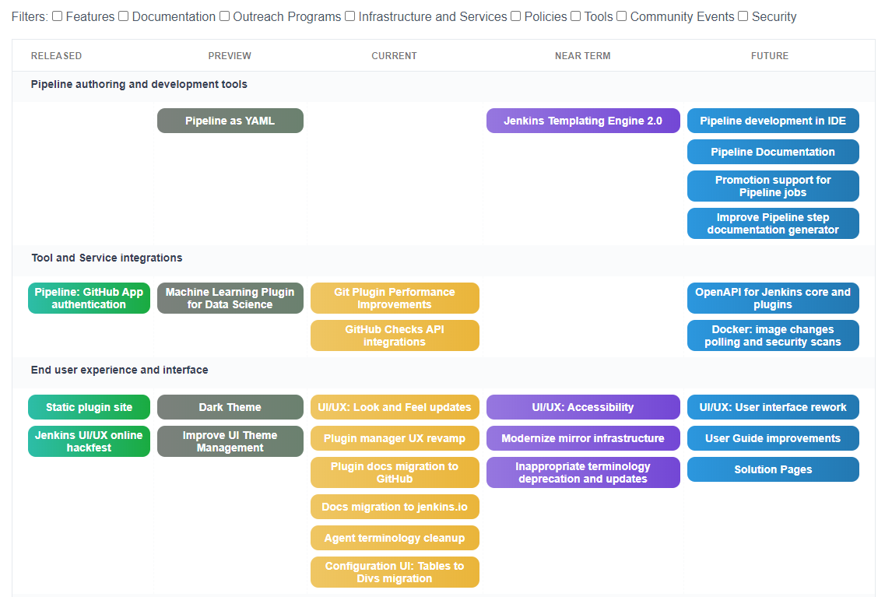

= JEP-14: Public roadmap for major initiatives in the Jenkins project
:toc: preamble
:toclevels: 3
ifdef::env-github[]
:tip-caption: :bulb:
:note-caption: :information_source:
:important-caption: :heavy_exclamation_mark:
:caution-caption: :fire:
:warning-caption: :warning:
endif::[]

.Metadata
[cols="1h,1"]
|===
| JEP
| 14

| Title
| Public roadmap for major initiatives in the Jenkins project

| Sponsor
| link:https://github.com/oleg-nenashev[Oleg Nenashev]

// Use the script `set-jep-status <jep-number> <status>` to update the status.
| Status
| Draft :speech_balloon:

| Type
| Process

| Created
| 2020-03-27

| BDFL-Delegate
| link:https://github.com/slide[Alex Earl]

//
// Uncomment if discussion will occur in forum other than jenkinsci-dev@ mailing list.
| Discussions-To
| link:https://groups.google.com/forum/#!topic/jenkinsci-dev/Ez7nZxlxSWk[Mailing list thread]
//
//
// Uncomment if this JEP depends on one or more other JEPs.
//| Requires
//| :bulb: JEP-NUMBER, JEP-NUMBER... :bulb:
//
//
// Uncomment and fill if this JEP is rendered obsolete by a later JEP
//| Superseded-By
//| :bulb: JEP-NUMBER :bulb:
//
//
// Uncomment when this JEP status is set to Accepted, Rejected or Withdrawn.
//| Resolution
//| :bulb: Link to relevant post in the jenkinsci-dev@ mailing list archives :bulb:

|===

== Abstract

This JEP documents a process and implementation for publishing and maintaining a public Jenkins "roadmap"
on the Jenkins website. This roadmap highlights major initiatives and is to be considered an official plan by the project.
Current version of the roadmap can be found here: link:https://www.jenkins.io/project/roadmap/[jenkins.io/project/roadmap/].

== Specification

=== Summary

* Jenkins project provides a public roadmap.
  It includes open data and a good browsing interface for users.
* The roadmap aggregates key initiatives in all areas: features, infrastructure, documentation, community, etc.
  Initiatives are categorized to reflect the structure of the project.
* We do not provide any target dates.
  Instead of that we provide 3 horizons: “Current”, “Near Term” and “Future”
* We do NOT commit on initiative delivery.
  Jenkins is a community-driven project, and the change will happen in areas where we have contributions. Initiatives in the roadmap may stop.
* Roadmap is contributed by key component maintainers (e.g. Jenkins Core, Remoting, packaging, etc.),
  special interest groups (Platform, UX, Docs, GSoC, ...),
  teams (Security, Infrastructure, Hosting, Release, ...), sub-projects (JCasC, ...),
  plugin maintainer teams and other entities.

=== Terms and definitions

====  Horizons

Instead of providing delivery dates for various initiatives on the roadmap, we use the following "horizons":

* **Future** - There is a consensus in the community that we would like this initiative to happen.
  We intend to work on that in the future, but there is no ongoing development.
* **Near Term** - We intend to start working on this initiative in the short term.
  There are contributors who declared their plans to work on this initiative soon, but there is no ongoing development.
* *Preview* - This initiative is available to Jenkins users and contributors for preview.
  It may mean a release in the experimental update center, generally-available release with proper preview notice,
  opt-in feature flag or configuration option, Beta API, or other documented way to deliver experimental changes in Jenkins.
* **Current** - Things being worked on presently with a known scope and design, typically specified a JEP.
* **Released** - Initiative which is largely completed and, in the case of user-facing changes, released/deployed.
It is also properly documented and announced.
There might be some minor follow-ups remaining.

=== Implementation

* Roadmap is visualized on the Jenkins website, as
https://jenkins.io/project/roadmap[https://jenkins.io/project/roadmap].
* Roadmap uses a machine readable data file stored in the jenkins.io GitHub repository.

=== Roadmap file structure

Roadmap data files use a machine readable YAML format.
There are two data files:

* `roadmap.yml` with the actual roadmap items being shown on the roadmap page
* `archive.yml` with historical data.
   It includesold completed and withdrawn initiatives which are not displayed on the roadmap page.

Roadmap data file includes:

* List of initiative statuses with descriptions
* List of initiative labels with descriptions and, if applicable, URLs
* List of initiative categories (based on use-case for Jenkins users or contributors).
  Each category includes a list of major initiatives to be displayed on the roadmap.
  Examples:
** User-focused: Configuration-as-Code, UI/UX, Security, Packaging and Distributions, etc.
** Contributor-focused: “Internal Infrastructure”, “Outreach programs”, “Governance”, etc.

Each initiative entry includes the following information:
* _Name_ - short summary displayed on the Roadmap dashboard
* _Description_ - detailed description which may be visualized in a popup window
* _Status_ - Status of the initiative
* _Labels_ - List of labels associated with the roadmap
* _URL_ - Link to a page providing details about the project.
The page should provide details about the initiative and, ideally, describe ways to contribute and contact the community.
Examples:
** Project page on jenkins.io (e.g. a
https://jenkins.io/projects/gsoc/2019/gitlab-support-for-multibranch-pipeline/[GSoC Project_])
*** Section on a jenkins.io page (e.g.
https://jenkins.io/sigs/docs#plugin-site-integration-with-github[project description on a SIG page])
*** Link to a Jira issue or EPIC (e.g.
https://issues.jenkins-ci.org/browse/WEBSITE-637[WEBSITE-637])

==== Roadmap YAML samples

The samples below show items which ar likely to be updated by Jenkins contributors.
See the link:https://github.com/jenkins-infra/jenkins.io/blob/master/content/_data/roadmap/roadmap.yml[roadmap.yml] for more examples.

Initiative sample:

```yml
  - name: "UI/UX: Look and Feel updates"
      status: current
      description: "Modernize the Jenkins Web interface styling and appearance"
      link: https://jenkins.io/sigs/ux/#project-ui-look-and-feel
      labels:
      - feature
```

Label definition sample:

```yml
- name: outreach-program
  displayName: Outreach Programs
  description: Initiatives which facilitate contributions to specific areas
  link: /sigs/advocacy-and-outreach/outreach-programs/
```

==== Rendering sample

The screenshot below visualizes a preview version of the roadmap,
and it might be out of date.
See link:https://www.jenkins.io/project/roadmap/[project roadmap] for the actual state.



=== Governance Documentation updates

Governance documents need to be updated to reference the Roadmap page:

* link:https://www.jenkins.io/project/governance[Project Governance Document]
* link:https://www.jenkins.io/project/#project-governance[Project structure and Governance]

=== Roadmap Management Process

==== Ownership

Roadmap is managed by the https://jenkins.io/project/board/[Jenkins Governance Board] (in the future “Roadmap maintainers”).
In the future this role may be transferred to a Technical Steering Committee if/when it is created.
They review and approve the roadmap suggestions for publishing.
There is also a quarterly public roadmap review meeting organized by the maintainers.

Controversial cases can be escalated to the developer mailing list.
If consensus is not reached on the developer mailing list,
controversial cases will be resolved at the https://jenkins.io/project/governance-meeting/[Jenkins Governance Meeting].

==== Eligibility

To be displayed on the roadmap, an initiative should match the following conditions:

* Major value to the Jenkins users or to the Jenkins community
* Confirmed interest in the initiative,
  based on the proposal review and consensus reached there.
* Significant scope of work and project duration.
  We expect major initiatives to take weeks/months to complete.
* Clear initiative description available on the initiative page.
* Nice to have: communication channels documented on the initiative page.
  Mailing list, Gitter, meeting links (if applicable).
* Nice to have: Contributing guidelines if there is any specifics in the project (required permissions, etc.)

==== Submitting roadmap suggestions

Any Jenkins contributor can submit a pull request with a suggestion for a Jenkins roadmap.
Suggestions will be reviewed by “Roadmap maintainers”, and they will get the SIGs, sub-projects and subject matter experts involved if needed.

* Each Jenkins community entity (e.g. SIG/sub-project/team) is eligible to add their roadmap entries.
  In such case initiatives should be discussed in the entity channels and signed off by the entity leader(s).
  _Roadmap maintainers_ still review the formal side of the request.
* Maintainers of other plugins and components are eligible to submit their roadmap proposals.
  Such pull requests will be reviewed by Roadmap Maintainers, see the _Eligibility_ section below.
* Any Jenkins community member can submit a proposal.
  If there is no SIG/sub-project behind the proposal, it will likely require a discussion in Jenkins channels to verify eligibility and improve visibility of the proposal.

==== Maintaining roadmap entries

We expect the initiative submitters to track progress of the roadmap initiatives and to update the initiative statuses accordingly.
The “Roadmap maintainers” team will be doing periodic scrubs of the roadmap to discover and modify outdated entries,
but there is no guarantee of full consistency for the roadmap (“eventual consistency”).
A contributor who discovers an issue is welcome to submit a pull requests or to report an issue link:https://github.com/jenkins-infra/jenkins.io/issues[here].

==== Roadmap review meeting

Once per quarter _Roadmap maintainers_ will organize a public roadmap review meeting.
It may be held as a part of the https://jenkins.io/project/governance-meeting/[Jenkins Governance Meeting] or as a separate meeting.
This meeting will be used to discuss the completed initiatives, verify the state of the roadmap and to identify the missing initiatives.

==== Preventing the roadmap from bloating

_Roadmap maintainers_ are responsible to keep the number of items in the roadmap within a comprehensible range.
Recommendation is to have a limited number of projects per category:

* "Released" - keep items for up to 6 months after the release
* “Current” - up to 5
* “Near Term” - up to 5
* “Future” - up to 5


To simplify search, initiatives should be labeled.
Other grouping mechanisms can be introduced later to make the initiatives more discoverable.

== Rollout plan

Once the proposal is confirmed in principle, the following process will be applied:

* The proposal is implemented and submitted as a pull request
* A developer mailing list email is sent to facilitate contributions to the draft (initial data and initiatives)
* `Mar 25, 2020` - There is voting at the governance meeting which signs-off publishing of the roadmap draft
* The roadmap draft is published as a draft with explicit “Work in Progress” disclaimers in the Web UI
* All entities in Jenkins (SIGs, sub-projects, etc.) are contacted via mailing lists and invited to contribute to the roadmap draft
* `2 weeks later` - There is a blogpost with a roadmap draft announcement and invitation to contribute in public
* Roadmap draft is presented at the Jenkins online meetup for developers
* `2+ weeks later` - Governance meeting with voting for publishing the roadmap as an active version
* Work-in-progress disclaimers are removed, the roadmap is considered as official
* Announcements in social media and the Jenkins blog

After the rollout, the roadmap will be maintained by the _Roadmap maintainers_ team as documented above.

== Motivation

Jenkins is a community-driven project.
Changes there happen only in those areas where we have contributors. 
At the same time, now we have a lot of entities like special interest groups, sub-projects and teams.
These entities drive many key initiatives in the community in a coordinated way, and largely use their own channels for that.
One has to find these channels to follow a project.
A Jenkins user or an outside contributor might have difficulties understanding what is going on and how to contribute.

This proposal documents a new roadmap process which would make planned changes more explicit and which would highlight the potential projects to Jenkins contributors and users.
It will help Jenkins users and vendors to properly plan their work and to contribute to the projects they are interested in.

== Reasoning

=== Why don’t we just use the Blue Ocean roadmap structure?

Blue Ocean roadmap is a good example of visualization and the implementation.
Blue Ocean roadmap was removed from the main site after putting the project on hold, but there is a version on cn.jenkins.io.

* Site: https://jenkins.io/zh/projects/blueocean/roadmap/
* Source code:
** Data JSON: https://github.com/jenkins-infra/cn.jenkins.io/blob/master/content/projects/blueocean/roadmap/data.json[/content/projects/blueocean/roadmap/data.json]
** https://github.com/jenkins-infra/cn.jenkins.io/blob/master/content/projects/blueocean/roadmap/index.html.haml[HAML for the page]
** CSS and JavaScript Code linked from the pages above

Blue Ocean layout does not work for us as is.
Reasons:

* Vertical layout is too long. We would need to make rendering better
* “Released” and “Not Planned” sections consume a lot of space.
  We need to somehow highlight “released” so that users can see new features,
  but “Not planned” is an overkill
* One story may belong to multiple categories (e.g. “Read-only Configuration Web UI” is both UX and Configuration-as-Code).
  In BlueOcean format there is only one category supported for an entry.

== Backwards Compatibility

N/A

== Security

Security concerns are not applicable to this process JEP. 

Jenkins security will be one of the categories in the roadmap,
and it will include public stories like Security hardening or security-related features.
Planned security fixes will not be included into the roadmap unless the Jenkins Security officer decides otherwise.

== Infrastructure Requirements

This proposal does not require additional services to be deployed.


== Testing

Testing will be performed as a part of the experimental phase until the roadmap is fully published.

== Prototype Implementation

* link:https://jenkins.io/project/roadmap/[Roadmap page on jenkins.io]
* link:https://github.com/jenkins-infra/jenkins.io/blob/master/content/_data/roadmap/roadmap.yml[Roadmap data YAML]

== References

* link:https://www.jenkins.io/project/roadmap/[Public Jenkins Roadmap page]
* link:https://github.com/jenkins-infra/jenkins.io/blob/master/content/_data/roadmap/roadmap.yml[Roadmap YAML file]
* https://docs.google.com/document/d/1-OGpDPWkOdKw-e8C0v9hUGgQshCLmToodo0biwlejdk/edit%23heading%3Dh.xmew3vtz09zz[Meeting notes - Jenkins contributor Summit on Jan 31, 2020]
* "Public Jenkins Roadmap preview" online meetup on Jul 10, 2020:
link:https://www.youtube.com/watch?v=ldWBY5BdQ5I[video recording] 
link:https://docs.google.com/presentation/d/1_T2nZhP1WS2Fw0OLVAJV14Ke6nEsqBjLcdAHiygCmNs/edit?usp=sharing[slides],
link:https://www.meetup.com/Jenkins-online-meetup/events/271768902/[Meetup page]
