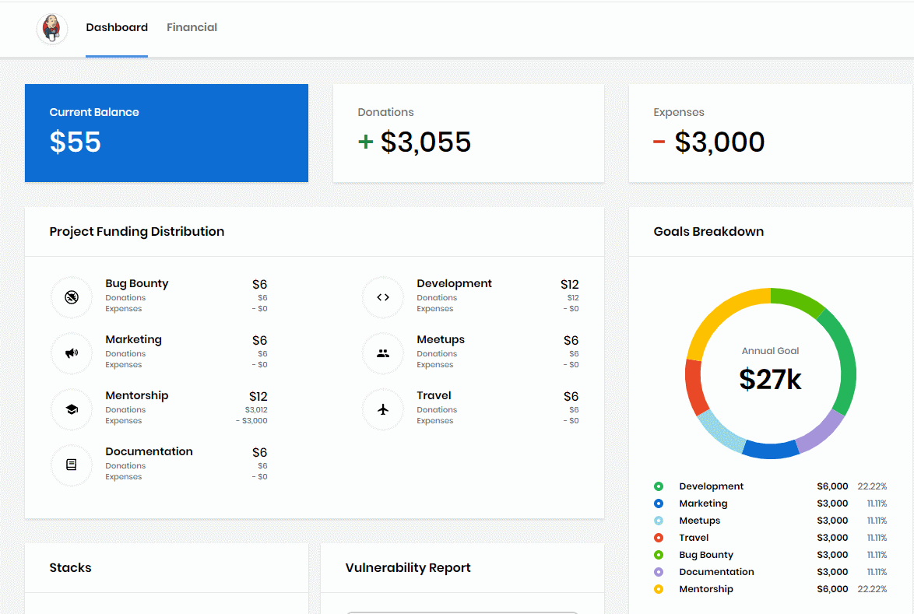
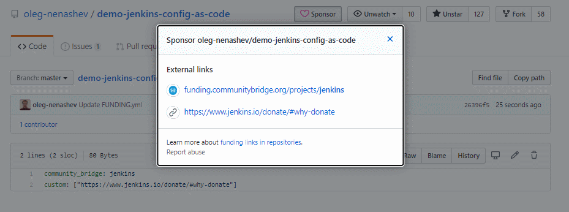

= JEP-15: Jenkins funding on LFX Crowdfunding
:toc: preamble
:toclevels: 3
ifdef::env-github[]
:tip-caption: :bulb:
:note-caption: :information_source:
:important-caption: :heavy_exclamation_mark:
:caution-caption: :fire:
:warning-caption: :warning:
endif::[]

.Metadata
[cols="1h,1"]
|===
| JEP
| 15

| Title
| Jenkins funding on LFX Crowdfunding

| Sponsor
| link:https://github.com/oleg-nenashev[Oleg Nenashev]

// Use the script `set-jep-status <jep-number> <status>` to update the status.
| Status
| Draft :speech_balloon:

| Type
| Process

| Created
| Date (2020-06-04)

| BDFL-Delegate
| TBD

| JIRA
| https://issues.jenkins-ci.org/browse/INFRA-2396[INFRA-2396]

| Discussions-To
| link:https://groups.google.com/forum/#!msg/jenkinsci-dev/iLutO2X0bdg/4nfrEetjDwAJ[Jenkins developer mailing list]
//
//
// Uncomment if this JEP depends on one or more other JEPs.
//| Requires
//| :bulb: JEP-NUMBER, JEP-NUMBER... :bulb:
//
//
// Uncomment and fill if this JEP is rendered obsolete by a later JEP
//| Superseded-By
//| :bulb: JEP-NUMBER :bulb:
//
//
// Uncomment when this JEP status is set to Accepted, Rejected or Withdrawn.
//| Resolution
//| :bulb: Link to relevant post in the jenkinsci-dev@ mailing list archives :bulb:

|===

== Abstract

This JEP documents the policy for donations received through the LFX Crowdfunding portal, formerly known as LFX CommunityBridge.
This JEP replaces original funding through SPI and ffis.de documented on link:https://www.jenkins.io/donate/p[jenkins.io/donate].
Jenkins profile on LFX Crowdfunding is available link:https://crowdfunding.lfx.linuxfoundation.org/projects/jenkins[here].

== Motivation

At the moment of this JEP submission the Jenkins project had no fully operational way for individuals or organizations to donate money to the project.
Donations through link:http://www.spi-inc.org/[Software in the Public Interest (SPI)] were deprecated due to the ongoing transition of the project
to link:https://cd.foundation/[Continuous Delivery Foundation (CDF)] as of May 2019.
Status of donations through ffis.de was unknown,
see link:https://issues.jenkins-ci.org/browse/WEBSITE-703[WEBSITE-703].

Jenkins project operates thanks to contributions and sponsorship (infra, meetups, swag, etc.).
Historically we did not have high cash flows in the project.
We mostly spend money on infra and outreach programs (swag, travel grants, Outreachy and LFX Crowdfunding in 2019).
Sponsorships cover most of our "big" expenses (e.g. Azure, meetup.com, contributor summits, etc.),
and there is a plan to formalize such donations through Continuous Delivery Foundation (CDF).
Sponsorship through CDF is a lengthy process not suitable for small donations.

It would be great to have a simple process so that we can raise money to facilitate the initiatives in the project and to cover infrastructure costs which have no sponsorship.
This proposal suggests using the link:https://crowdfunding.lfx.linuxfoundation.org/[LFX Crowdfunding] service which is operated by the Linux Foundation and used by many projects within the foundation and sub-foundations like CDF. 

== Specification

=== Profile setup

Jenkins project will have a single profile link:https://crowdfunding.lfx.linuxfoundation.org/projects/jenkins[here].
Sub-projects and plugin teams may introduce their own profiles on LFX Crowdfunding or elsewhere,
but it is not within scope of this JEP.
The profile page will have a project description and a reference to this process JEP.

image::funding_top.png[LFX Crowdfunding Profile]

=== Donation destinations

==== Enabled donation destinations

The following donation destinations will be enabled on the LFX Crowdfunding profile:

* _Bug Bounty_ - link:https://www.jenkins.io/security/gift/[Gifts for Security Vulnerability reports]
* _Development_
** Facilitating development initiatives within the link:https://www.jenkins.io/project/roadmap/[Jenkins Roadmap] (e.g. online hackfests, mentorship projects).
** Covering development-related infrastructure costs.
* _Documentation_
** Facilitating documentation initiatives within the link:https://www.jenkins.io/project/roadmap/[Jenkins Roadmap] (e.g. online hackfests, mentorship projects)
** Covering documentation-related infrastructure costs.
* _Marketing_ -  sponsoring marketing outreach programs (e.g. swag to contributors)
* _Mentorship_ - sponsoring link:https://www.jenkins.io/sigs/advocacy-and-outreach/outreach-programs/[outreach programs] like Outreachy or LFX Mentorship
* _Meetups_ - sponsoring link:https://www.jenkins.io/events/online-meetup/[Jenkins Online Meetups] 
               and link:https://www.jenkins.io/projects/jam/[local meetups] (swag, promotion materials)
* _Travel_ - funding the Jenkins Travel Grant Program (see link:../12/README.adoc[JEP-12])

Donations will **NOT** be used for paying personnel.

==== Donations to infrastructure

At the moment LFX Crowdfunding does not support _Infrastructure_ as a donation destination.
There is a request for enhancement submitted for it, but there is no confirmed delivery date for that.
Although the majority of the Jenkins infrastructure costs are covered by sponsorships,
we still spend some money.

Many link:https://www.jenkins.io/projects/infrastructure/#services[Jenkins infrastructure services] are used to serve documentation to users (jenkins.io, plugins.jenkins.io, etc.) or to support the Jenkins development flows (ci.jenkins.io, repo.jenkins.io, bugtracker, etc.)
We may dedicate _Development_ and _Documentation_ donations to cover infrastructure costs, e.g.:

* Covering network transit costs (not including those incurred by mirrors)
* SSL certificates on services which have not been migrated to LetsEncrypt or similar services
* Domain costs
* Cost of services used to support the infrastructure (e.g. CDN)
* Equipment/replacement hardware

==== Donation goals

This JEP does not define specific donation goals.
The reference implementation sets an example annual goal and the distribution.
The screenshot below defines the sample goals from the prototype implementation.

Actual donation goals are to be defined by the link:https://www.jenkins.io/project/governance-meeting/[Jenkins Governance Meeting] at the beginning of each year.



==== Targeted donations

Supporters may donate money for specific projects or roadmap initiatives.
Example: sponsoring a particular outreach program (e.g. Outreachy) or a specific feature (e.g. JCasC Plugin for Visual Studio Code).
Such donations should be discussed with the Jenkins Board and finally approved by the Governance meeting before the donation happens.
If approved, such donations will be reserved for a specific project and not used for alternate expenses.

Targeted donations must not be considered as a contract work.
Donations will **NOT** be used for paying personnel.
They will be used to facilitate a particular initiative through the Jenkins community (events, mentorship programs, etc.).
In no case Jenkins project will commit to deliver a feature or on a timeline based on a donation.

=== Process guidelines

==== Roles and terms

* _Supporter_ - An individual or an organization donating money to the Jenkins project.
* _Expense Requester_ - An individual or a company contributor requesting reimbursement.
* _LFX Crowdfunding Administrator_ - a Jenkins board member with administrative access to the LFX Crowdfunding profile and the Expensify account connected to it.
** Right now the LFX system supports only one administrator (currently Oleg Nenashev), others can be added to Expensify upon request.
** Similar to the former SPI reimbursement process,
   Jenkins governance board is responsible for approving all expenses submitted through the system.
   The approval process is documented below.

==== Use of donations

As stated in the link:https://docs.linuxfoundation.org/lfx/crowdfunding[LFX Crowdfunding documentation],
_the project maintainers can adjust fund allocations and may not use the funds per requested allocation_.
In the Jenkins project we intend to respect the targeted allocations,
and to follow the requested allocation when possible.
We may diverge from that in the case of emergency project needs.

Decisions about allocating money are made at the link:https://www.jenkins.io/project/governance-meeting/[Jenkins Governance Meeting],
unless there is an exception documented in another JEP
(e.g. link:./8/README.adoc[JEP-8: Google Summer of Code Budgeting and Expenses]).
Budget requests should be submitted to the developer mailing list and discussed there,
the Governance meeting will be doing a formal approval/rejection based on the community feedback.

==== Donations Process

Donations should be submitted through the LFX Crowdfunding system which supports donations by individuals and by organizations.
It is possible to do a donation for "all project needs" or a targeted donation to any destination listed above.
The process is documented link:https://docs.linuxfoundation.org/lfx/crowdfunding[here].

For the Jenkins project all payment options are enabled:

* One-time or monthly donations through via credit or debit card
* One-time donations through invoices - for organizations making one-time donations

==== Reimbursement Process

* Expenses should be pre-approved through the Jenkins developer mailing list and
the link:https://www.jenkins.io/project/governance-meeting/[Governance meeting] **BEFORE** the expense happens.
* The requester is registered on the LFX Crowdfunding portal as a beneficiary.
* After the expense happens, the requester should submit the expense report through the LFX Crowdfunding's Expensify portal.
* Expense reports should be approved by a LFX Crowdfunding Administrator.

=== Implementation

==== LFX Crowdfunding Portal

* LFX Crowdfunding configuration should be updated according to this JEP
* At least 3 Jenkins Governance Board members should be added to the Expensify backend

==== jenkins.io

* link:https://www.jenkins.io/donate/[jenkins.io/donate] should be updated
** _Why donate?_ should be updated to reflect motivation of this JEP and to reference non-infrastructure donations.
** The page should reference this Jenkins Enhancement proposal.
** Donations through SPI and ffis.de should be removed from the page as obsolete.

==== GitHub Sponsor buttons

One of the ways to facilitate the donations is to make donation buttons explicit on GitHub.
There is a way to link:https://help.github.com/en/github/administering-a-repository/displaying-a-sponsor-button-in-your-repository[display a sponsor button in a repository]
which allows adding multiple links via a `FUNDING.yml` metadata file.

* link:https://github.com/jenkinsci/[jenkinsci] GitHub organization -
  Sponsor button is added to the Jenkins core and other core components.
** Maintainers of plugins, tools, and subprojects can add the Sponsor buttons if they wish.
   They can use the Jenkins project funding or to setup their own funding.
* link:https://github.com/jenkins-infra/[jenkins-infra] -
  Funding is enabled globally inside the organization via `FUNDING.yml` in link:https://github.com/jenkins-infra/.github[jenkins-infra/.github]

Sample `FUNDING.yml`:

```yml
community_bridge: jenkins
custom: ["https://jenkins.io/donate/#why-donate"]
```

Resulting UI:



==== Promotion

Once the LFX Crowdfunding setup is finalized and the JEP is accepted,
we will promote the new funding portal through the Jenkins blog and social media.
CDF and Linux Foundation resources will be used to promote the funding portal.

There will be no wide promotion campaign of funding through the Jenkins resources and distributions.
It might be considered if the Jenkins project needs to raise money to cover the day-to-day operations needs,
but it is out of the scope of this JEP.

== Reasoning

=== Why LFX Crowdfunding and not another service?

There are indeed multiple funding and donations services available for open-source projects.
Notable ones are Open Collective, GitHub Sponsors, Patreon and so on.
These services provide comparable functionality and services.
LFX Crowdfunding is a service link:https://www.linuxfoundation.org/press-release/2019/03/the-linux-foundation-launches-new-communitybridge-platform-to-help-sustain-open-source-communities/[launched in Mar 2019],
and it might be less popular than other services.

LFX Crowdfunding is chosen based on a fact that it is provided by the Linux Foundation.
Jenkins project is a part Continuous Delivery Foundation which is a part of the Linux Foundation. 
So the suggested decision is to use a service provided by the project's foundation.

There are some advantages which justify this choice:

* Supports for donations by individuals and by organizations.
* Support for anonymous donations.
* Support for showing a history of donations and a list of supporters.
* Support provided by the Linux Foundation which is not a 3rd party for the project.
* Expensify as a backend for expense reports management.
  It simplifies managing expenses by contributors, with the Linux Foundation providing support for payment logistics.
* Integration with the link:https://lfx.linuxfoundation.org/tools/mentorship[LFX Mentorship service] which allows running mentorship programs and funding them through LFX Crowdfunding.

== Backwards Compatibility

N/A

== Security

* Only Jenkins board members will have access to the Expensify administrative backend.
  This might be changed in future versions of this JEP (e.g. when a new treasurer role is introduced).
* All Expensify account administrators will be required to configure a two-factor authentication
* LFX account administrators are expected to periodically review the list of beneficiaries and clean up obsolete entries
  so that a limited number of users can submit the expense reports.

== Infrastructure Requirements

* Infrastructure is provided by the Linux Foundation
** link:https://crowdfunding.lfx.linuxfoundation.org/[LFX Crowdfunding Portal]

== Testing

N/A

== Prototype Implementation

A LFX Crowdfunding proof-of-concept was set up as a part of the LFX Mentorship evaluation in 2019.

* link:https://crowdfunding.lfx.linuxfoundation.org/projects/jenkins[Jenkins project's profile] on LFX Crowdfunding.
* link:https://github.com/oleg-nenashev/demo-jenkins-config-as-code[Sample repository] with `FUNDING.yml` setup.

== References

* link:https://crowdfunding.lfx.linuxfoundation.org/projects/jenkins[Jenkins Profile on LFX Crowdfunding]
* link:https://docs.linuxfoundation.org/lfx/crowdfunding[LFX Crowdfunding Funding Documentation]
* link:https://lfx.linuxfoundation.org/#funding[LFX Crowdfunding Funding FAQ]
* link:https://wiki.jenkins.io/display/JENKINS/Reimbursement+of+Expenses+via+SPI[Reimbursement of Expenses via SPI]
