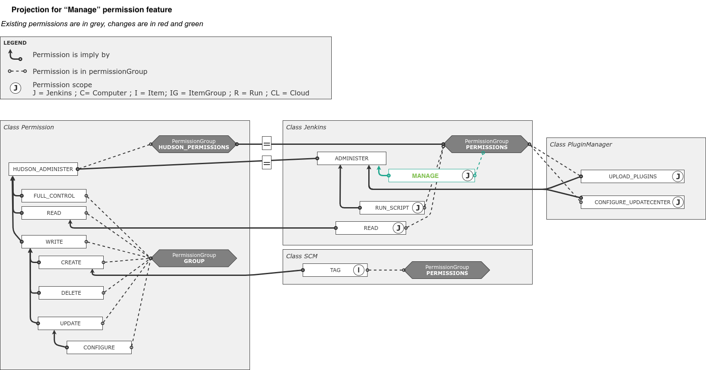
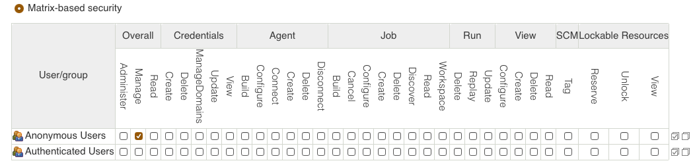
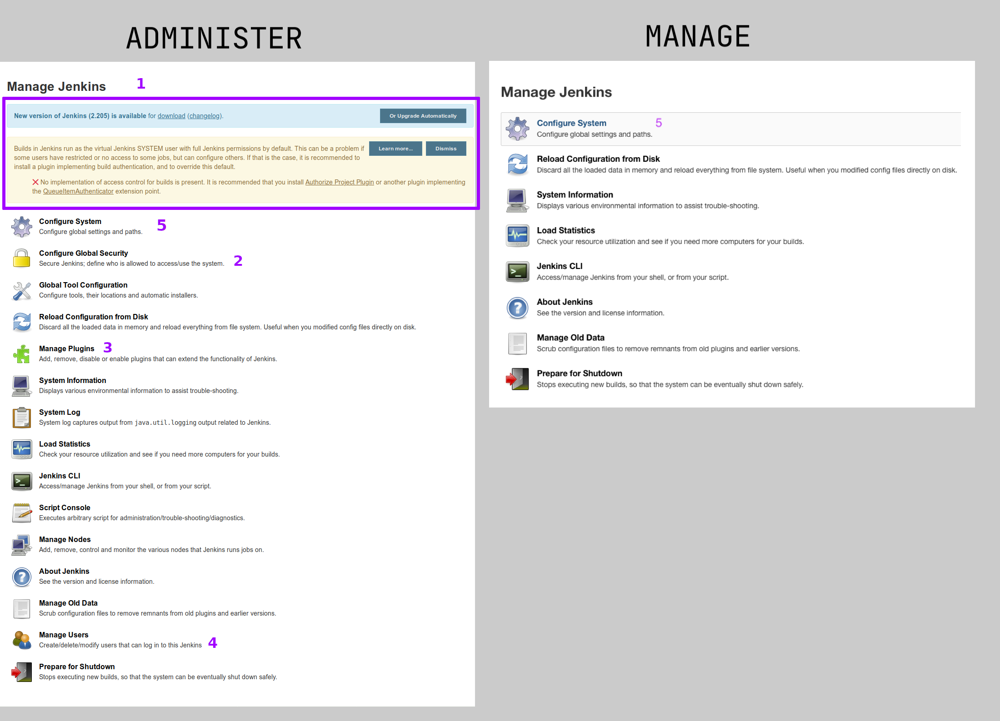

= JEP-223: "Manage" permission for managing non-security aspects of a Jenkins instance
:toc: preamble
:toclevels: 3
ifdef::env-github[]
:tip-caption: :bulb:
:note-caption: :information_source:
:important-caption: :heavy_exclamation_mark:
:caution-caption: :fire:
:warning-caption: :warning:
endif::[]

.**JEP Template**


.Metadata
[cols="1h,1"]
|===
| JEP
| 223

| Title
| "Manage" permission for managing non-security aspects of a Jenkins instance

| Sponsor
| link:https://github.com/mikecirioli[Mike Cirioli], link:https://github.com/aHenryJard[Angélique Jard], link:https://github.com/EstherAF[Esther Álvarez Feijoo] 

// Use the script `set-jep-status <jep-number> <status>` to update the status.
| Status
| Draft :speech_balloon:

| Type
| :bulb: Standards :bulb:

| Created
| :bulb: (2019-11-01) :bulb:

| BDFL-Delegate
| TBD

//
//
// Uncomment if there is an associated placeholder JIRA issue.
| JIRA
| :bulb: https://issues.jenkins-ci.org/browse/JENKINS-60266[JENKINS-60266] :bulb:
//
//
// Uncomment if discussion will occur in forum other than jenkinsci-dev@ mailing list.
| Discussions-To
| :bulb: https://groups.google.com/forum/#!topic/jenkinsci-dev/lThSifB8G4k :bulb:
//
//
// Uncomment if this JEP depends on one or more other JEPs.
//| Requires
//| :bulb: JEP-NUMBER, JEP-NUMBER... :bulb:
//
//
// Uncomment and fill if this JEP is rendered obsolete by a later JEP
//| Superseded-By
//| :bulb: JEP-NUMBER :bulb:
//
//
// Uncomment when this JEP status is set to Accepted, Rejected or Withdrawn.
//| Resolution
//| :bulb: Link to relevant post in the jenkinsci-dev@ mailing list archives :bulb:

|===

== Abstract

When using matrix-based access control, the permission types `Jenkins.RUN_SCRIPTS`, `PluginManager.CONFIGURE_UPDATECENTER`, and `PluginManager.UPLOAD_PLUGINS` provide a false sense of security, as a user is able to escalate this limited privilege to `Jenkins.ADMINISTER`.  
link:https://jenkins.io/security/advisory/2017-04-10/#matrix-authorization-strategy-plugin-allowed-configuring-dangerous-permissions[SECURITY-410] removed the ability to individually grant these permissions, as they are effectively equivalent to `Jenkins.ADMINISTER`.

A new permission type, `Jenkins.MANAGE` (implied by `Jenkins.ADMINISTER`, and belonging to the same "Overall" permission group) has been created for actions that allow for the management of Jenkins configuration items that do not require `Jenkins.ADMINISTER`.
This new permission is used to create a clear separation between settings that impact the entirety of a Jenkins instance (particularly with regards to security) and those that can be used to manage other aspects of an installation. 
This type of permission is a form of "Management" capability, a term used to describe permissions that can be used to delegate the ability to manage specific aspects of an instance without granting an overall administrative permission.

== Specification

Any methods that check for `Jenkins.ADMINISTER`, `Jenkins.RUN_SCRIPTS`, `PluginManager.MANAGE_UPDATECENTER`, and `PluginManager.UPLOAD_PLUGINS` will be evaluated to determine if the use of the new `Jenkins.MANAGE` permission type is appropriate.
The general rule of thumb is that configuration items which do not let you change the underlying security model (either directly, or through a malicious plugin or groovy script), or change fundamental configurations such as hostnames, proxy configuration, etc. are likely candidates to use the `Jenkins.MANAGE`.
Plugins that using the deprecated `Plugin#configure` mechanism will not be exposed to users with the `Jenkins.MANAGE' permission.
Prior to this change, plugins could assume that, in the abscence of performing an explicit permission check themselves, access would be restricted by default because any top level management links require `Jenkins.ADMINISTER` permission in order to access them.
To mitigate the risk of a plugin that does not perform an explicit permission check exposing a potentially "dangerous" configuration option, Jenkins will assume by default that the `Jenkins.ADMINISTER` permission is required to render any plugin options exposed via a management page.

The changes to the existing permissions are detailed in the diagram below. 



Specifically, for an installation of Jenkins v2.207 with the default suggested plugins, the following configuration items would be available to a user with the `Overall/Manage` permission:

* `<JENKINS_URL>/manage`
** `Configure System` (see next item for details)
** `Reload Configuration From Disk`
** `System Information`
** `Load Statistics`
** `Jenkins CLI`
** `About Jenkins`
** `Prepare For Shutdown`
* `<JENKINS_URL>/configure`
** `Home Directory` (_read only_)
** `System Message`
** `Quiet Period`
** `SCM checkout retry count`
** `Restrict project naming`
** `Pipeline Default Speed/Durability Level` (Pipeline: API Plugin)
** `Enable Anonymous Usage Statistics`
** `Enable BuildStep Action` (Build Timeout Plugin)
** `Git plugin global config` (Git Plugin)
** `Subversion global config` (Subversion Plugin)
** `Extended E-mail Notification` (Email Extension Plugin)
** `Basic E-mail Notificaiton` (Jenkins Mailer Plugin)

Plugins and configuration settings not listed above are considered to be out of scope for this JEP.
Once the new permission is avaible in a core Jenkins release, we plan to review additional plugins and work with their maintainers to introduce the new permission when possible, for example (but not limited to):

* Default location of local maven repository and configuration
* Many (not all) plugins global configuration
** Global compiler warnings (Warnings NG Plugin)  
** Bitbucket endpoints (Bitbucket Branch Source Plugin)
** Trigger restrictions (Job Restrictions Plugin)
** Timestamp format (Timestamper Plugin)
** Slack (Global Slack Notifier Plugin)
* Jira integration (JIRA Plugin)

Jenkins configuration settings that will continue to require the "Overall/Administer" permission are:

* *Administrative Monitors* - Administrative Monitor messages will only be shown if the user has the permission `Jenkins.ADMINISTER` because they may contain an action button that can lead to security modifications. 

* *Configure Global Security* - A user who can make changes here is able to configure Jenkins to use a less secure realm, or grant themselves additional permissions; thus, this configuration link will only be shown to users with the `Jenkins.ADMINISTER` permission.

* *`Manage Old Data`* - Because `Jenkins.MANAGE` does not imply overall `Job/Read`, allowing a user without `Jenkins.ADMINISTER` to access this link could expose details about job/builds as well as parts of their configuration.

* *Manage Plugins* - A user with the ability to manage plugins is able to remove or replace security related plugins, or even upload a malicious plugin; thus, this configuration link will only be shown to users with the `Jenkins.ADMINISTER` permission.

* *Manage Users* - Managing users includes the ability to delete any user, so this link will only be shown to users with the `Jenkins.ADMINISTER` permission.

This is list not exhaustive, other items might be limited to users with `Jenkins.ADMINISTER` permission for similar reasons.

=== Jenkins UX Changes
Changing the permission model primarily impacts the Jenkins UX in two ways- the permissions shown when configuring matrix-based authentication and what a user with "Overall/Manage" permission can access via the `Manage Jenkins` page. 



By default, all of the configuration sections in the `/manage` page require `Jenkins.ADMINISTER`.
Each configuration section that is accessible by a user with `Jenkins.MANAGE` are explicitly allowed by overriding `ManagementLink.getRequiredPermission()` to return `Jenkins.MANAGE`. For example :

```java
public class CustomLink extends ManagementLink {

    @Override
    public Permission getRequiredPermission() {
        return Jenkins.MANAGE;
    }
}
```

Plugins may also need to change permissions on jelly files to allow `Jenkins.MANAGE` on management links.

```xml
<l:hasPermission permission="${app.ADMINISTER}">
    //jelly code that should only be shown to a user with Jenkins.ADMINISTER permission
    ....
    ....
</l:hasPermission>
```

 
image::UX_config_tools.png[Configure System details.]

[NOTE]
====
Plugins that contribute to the settings on on the `Configure Jenkins` page should carefully consider if allowing a user with only `Jenkins.MANAGE` could result in an unintended privilege escalation.
====

== Motivation

The current permission model does not provide a means by which some aspects of Jenkins administration can be delegated to a user without also giving them the ability (directly or indirectly) to modify configuration settings that globablly impact the instance.

By consolidating all permission types that effectively allow a user to have full `root` access on a Jenkins instance, and introducing a new permission (`Jenkins.MANAGE`) that allows a limited amount of access to configure certain non-critical functionality, a Jenkins administrator can safely delegate configuration aspects while being confident that security concerns are being met.

The `Jenkins.MANAGE` permission type is not intended to replace any `Item` level permissions.
It is solely for the purpose of separating sensitive, security related Jenkins configuration settings from those that a non-root administrator might be expected to manage.

=== Example Use Case
**Alice** - DevOps Admin - responsible for overall Jenkins infrastructure, supporting 100 developers across 6 teams, each with their own jenkins instances.  Responsible for defining and enforcing security policies across all teams.

**Bob** - DevOps lead for the FooBar team

==== Scenario

Alice has defined the following company wide security policies:

* AuthN will be handled via SSO backed by the corporate LDAP server
* Role-Based AuthZ is provided by the matrix-auth plugin
* All Jenkins instances must only use the company approved update-center
* Only users with Jenkins.ADMINISTER privileges can upload plugins outside of the update-center

Additionally, Alice wants to allow individual DevOps leads to manage other aspects of their Jenkins instances as they deem appropriate for their own teams.  Ex. Bob can configure:

* Project naming conventions
* System Admin e-mail address
* Labels
* View system information

[NOTE]
====
Admittedly, the example use case above is not all that exciting.  However, the change proposed in this JEP creates the foundation for other plugins to begin to differentiate between high-risk (ie. Administer only) settings and those that can be safely delegated to a user with the `Configure` permission.
====

== Reasoning
=== Administrative Monitors only shown to users with `Jenkins.ADMINISTER`
We choose to not show a subset of "safe" Administrative Monitors because it could lead to a false sense of security from the perspecitve of a user with the `Jenkins.MANAGE` permission. 
Some critical messages would be only displayed to `Jenkins.ADMINISTER` and a user with `Jenkins.MANAGE` might think that everything is fine when it's not because nothing is displayed.

=== System Log is only accesible with `Jenkins.ADMINISTER`
In theory, logs shouldn't show sensitive values at any level, and a plugin logging secrets can be considered a security issue in the actual plugin.
However, it is highly likely that some plugins are logging sensitive values in lowest levels like `FINE`.

Because of this, `Jenkins.MANAGE` will not be allowed to access to the System Log or managing Log Recorders.

As part of a future enhancement, a more sophisticated solution might be considered, so someone with `Jenkins.MANAGE` can see log levels which are considered safe (`Log.INFO`, `Log.DEBUG`, etc).

=== `Jenkins.MANAGE` does not allow installation of plugins available in Update Center
There has been some discussion on the jenkinsci-dev mailing list about whether `Jenkins.MANAGE` should allow the installation of plugins available in Update Center (see <<References>>).  
The abiltiy to install or update plugins introduces the possibility (even if it is small) for a malicious user to escalate their privilege to that of `Jenkins.ADMINISTER`.  
Additionally, some administrators may not want users who can update plugin versions to also have the ability manage other aspects of a Jenkins instance.
Because of this, it makes more sense to consider this as a potentially new permission type in the future.

=== `Jenkins.MANAGE` implies no other permission

For the sake of customization, we are designing this permission to not imply other permissions that can be granted separately, as long as they are not needed for `Jenkins.MANAGE`'s main purpose (see <<Motivation>>).

Hence, it will not imply any `Job`, `View` or `Agent` level permission.

About `Jenkins.READ` (a.k.a `Overall Read`, required to access the web or use the CLI), we have decided to *not* imply it for the following reasons:

* To follow the current standard: Every other permission (except `Jenkins.ADMINISTER`) is not implying it. 
* Technical limitation: The current implementation of `Permission` makes it impossible for `Jenkins.MANAGE` to imply `Jenkins.READ`, because a permission can not be implied by more than one, and `Jenkins.READ` is already implied by `Permission.READ`. 

image::CONFIGURE-and-READ-permissions.svg[]

This means that in order to provide access with `Jenkins.MANAGE` permission, the Administrator will have to check both `Overall Read` and `Overall Configure`

=== Decisions we are on the fence about
There are a number of specific permission checks that do not have a clear answer, such as the ability to view log files, or viewing environment variables. 
For the most current discussions on these points (and more) please refer to link:https://github.com/jenkinsci/jenkins/pull/4374[the prototype PR for this JEP].

== Backwards Compatibility

No existing permission types are being removed at this point, which will allow for existing plugins that make use of them to continue to function.
Removing code references to the "dangerous" permissions is outside the scope of this JEP.
Since the granting of the `Jenkins.MANAGE` is optional, administrators who find the new permission does not provide value for them can simply continue to grant `Jenkins.ADMINISTER` to users who need overall administrator access (`Jenkins.MANAGE` is implied by `Jenkins.ADMINISTER`).
While we do not anticipate that this change will introduce any regressions, we do acknowledge that some cases may be found after the initial release that may result in confusing or broken behavior for some plugins (ex. a configure link is shown for some plugin, but clicking it results in a permission failure when actually accessing its management link).  
Because of this, we (the JEP-223 sponsors) are committed to the following support policy:

* For issues raised against Jenkins Core, we will review and fix (or provide justification for not fixing) problems related to this change within 3 months of the LTS release
* For issues raised against plugins that are installed by default through the setup wizard, we will review and fix (or provide justification for not fixing) problems related to this change within 3 months of the LTS release
* For issues raised against plugins that are not installed by default through the setup wizard, we will review and determine the level of impact caused by the regression.  If the issued is determined to create a significant regression we will commit to providing a fix or workaround.

[NOTE]
====
link:https://github.com/jenkinsci/jep/tree/master/jep/224[JEP-224] proposes adding a new permission `Jenkins.SYSTEM_READ` which could cause a confusing user experience when combined with the `Jenkins.MANAGE` permission unless care is taken to implement things in a sensible way.
If JEP-223 is accepted first, we intend to work with the authors of JEP-224 to ensure that administrators will leverage both proposed features in a way that creates a positive experience for users.
====

== Security

The intent of this proposal is to improve overall security for Jenkins instances that are using some form of matrix authorization.
All configuration items that require `Jenkins.ADMINISTER`, `Jenkins.RUN_SCRIPTS`, `PluginManager.CONFIGURE_UPDATECENTER`, and `PluginManager.UPLOAD_PLUGINS`  are being reviewed to determine if they can be changed to require the new `Jenkins.MANAGE` permission type.
The greatest risk is that some configuration may be _more restrictive_ than necessary, either because it was overlooked or due to differences in opinion during the review process.

=== Specific focus on ManagementLink.getRequiredPermission()

Previously, the “/manage” page was only accessible to a user with the `Jenkins.ADMINISTER` permission, and the `ManagementLink` links on this page were protected by virtue of the StaplerProxy performing a permission check for `Jenkins.ADMINISTER`.  Now that the “/manage” page can be accessible by other permission types it is important that all classes that extend `ManagementLink` return a sensible default access permission.

To do it we need to change the default value of getRequiredPermission() from:

```
public @CheckForNull Permission getRequiredPermission() {
    return null;
}
```

to default `Jenkins.ADMINISTER`:
```
public @CheckForNull Permission getRequiredPermission() {
    return Jenkins.ADMINISTER;
}
```
This change  only removes the links that are displayed in the "/manage" page for users that don't have the related permission.  Users with the `Jenkins.ADMINISTER` permission will not see any changes in the “/manage” page, and users with the `Jenkins.MANAGE` permission will only see links that have explicitly override the default implementation of `getRequiredPermission`.
As this could break plugin compatibility, we did an analysis on the plugin usage of `getRequiredPermission` or `requiredPermission` in jelly/groovy.

.Table Plugin usage analysis of ManagementLink.getRequiredPermission()
|===
|Plugin |Analyse |Reason

|multi-slave-config-plugin
|No change
|getRequiredPermission() is overrided with `ADMINISTER` in the ManagementLink

|scriptler-plugin
|No change
|Manages its own permission in the ManagementLink

|p4-plugin
|No change
|The requiredPermission is used from an Action and UnprotectedRootAction class, not a ManagementLink class.

|periodic-jobs-balancer-plugin
|No change
|getRequiredPermission() is overrided with `ADMINISTER` in the ManagementLink

|gerrit-trigger-plugin
|No change
|getRequiredPermission() is overrided with `ADMINISTER` in the ManagementLink. Also used in RootAction but not related to the change in ManagementLink.

|lenient-shutdown-plugin
|No change
|getRequiredPermission() is overrided with `ADMINISTER` in the ManagementLink

|script-security-plugin
|No change
|getRequiredPermission() is overrided with `RUN_SCRIPT` in the ManagementLink

|active-choices-plugin
|No change
|Based on scriptler-plugin

|docker-plugin
|No change
|Does not override getRequiredPermission() in the ManagementLink and use it in jelly. Due to DockerManagement#getTarget, requiring `ADMINISTER` is the expected behavior.

|libvirt-slave-plugin
|No change
|Does not override getRequiredPermission() in the ManagementLink and use it in jelly. Due to VirtualMachineManagement#getTarget, it's expected to be restricted to `ADMINISTER`.

|build-with-parameters-plugin
|No related
|The requiredPermission is used from an Action class, not a ManagementLink class.

|metadata-plugin
|No related
|The requiredPermission is used from an RootAction class, not a ManagementLink class.

|flaky-test-handler-plugin
|No related
|The requiredPermission is used from an Action class, not a ManagementLink class.

|ssh-slaves-plugin
|No related
|The requiredPermission is used from an Action class, not a ManagementLink class.

|docker-traceability-plugin
|No related
|The requiredPermission is used from an RootAction class, not a ManagementLink class.

|rebuild-plugin
|No related
|The requiredPermission is used from an Action class, not a ManagementLink class.

|global-build-stats-plugin
|No change
|getRequiredPermission() is overrided with `ADMINISTER` in the ManagementLink

|global-build-stats-plugin
|No change
|getRequiredPermission() is overrided with `ADMINISTER` in the ManagementLink

|selenium-plugin
|No change
|The requiredPermission is used from an *Action class and PluginImpl class, not a ManagementLink.

|build-metrics
|No change
|requiredPermission used from ManagementLink in views but the "it" is not the correct one and thus no impact.

|dynamicparameter
|No change
|The requiredPermission is asked on ScriptlerChoiceParameterDefinition.DescriptorImpl and ScriptlerStringParameterDefinition.DescriptorImpl but the classes and respective hierarchies are missing the desired method/field. Seems to be a bug in that plugin.

|support-core
|No change
|Lots of getRequiredPermissions, due to the Component approach, nothing impacting.

|workflow-cps
|No change
|Lots of getRequiredPermissions, due to the Component approach, nothing impacting.
|===

== Infrastructure Requirements

There are no new infrastructure requirements related to this proposal.

== Testing
This feature will initially be release as "experimental", and disabled by default.
To enable the `Overall/Manage` permission do one of the following:

* Set the system property `jenkins.security.ManagePermission=true` when starting Jenkins.
* Execute the following via the Script Console:  `System.setProperty('jenkins.security.ManagePermission', 'true')` 

To use Jenkins.MANAGE permission in a plugin, the plugin must be build with the `-DuseBeta=true` option enable. For example `mvn clean install -DuseBeta=true`.
Existing tests that validate permissions, or make assumptions about the permissions being used, will be updated to conform to the new permission model.
Additional tests will be written that validate the new permission type cannot be used when the more restrictive `Jenkins.ADMINISTER` is needed.

== Prototype Implementation
[NOTE]
The prototype code can be found at:

* link:https://github.com/jenkinsci/jenkins/pull/4501[Minimal PR which implements the new permission (merged, targeted for 2.222 weekly)]
* link:https://github.com/jenkinsci/jenkins/pull/4483[DRAFT PR with proposed changes and tests (including the minimal PR changes)]

== References
=== Mailing List Discussions
* link:https://groups.google.com/forum/?utm_medium=email&utm_source=footer#!msg/jenkinsci-dev/lThSifB8G4k/HqaHxNoNCgAJ[Should Jenkins.CONFIGURE allow installation of plugins available in Update Center]

=== Related efforts
* link:https://jenkins.io/security/advisory/2017-04-10/#matrix-authorization-strategy-plugin-allowed-configuring-dangerous-permissions[SECURITY-410 - Matrix Authorization Strategy Plugin allowed configuring dangerous permissions]

* link:https://issues.jenkins-ci.org/browse/JENKINS-60406[Deprecate Jenkins.RUN_SCRIPTS, PluginManager.UPLOAD_PLUGINS, & PluginManager.CONFIGURE_UPDATECENTER]
** Parallel effort to officially deprecate (in the code) permissions which effectively equate to `Jenkins.ADMINISTER`

* link:https://issues.jenkins-ci.org/browse/JENKINS-12548[Read-only configuration summary page support]
* link:https://github.com/jenkinsci/jep/tree/master/jep/224[JEP-224 - Jenkins.SYSTEM_READ proposal] 
