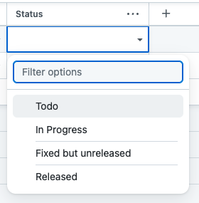

= JEP-238: GitHub issues for core components
:toc: preamble
:toclevels: 3
ifdef::env-github[]
:tip-caption: :bulb:
:note-caption: :information_source:
:important-caption: :heavy_exclamation_mark:
:caution-caption: :fire:
:warning-caption: :warning:
endif::[]

.Metadata
[cols="1h,1"]
|===
| JEP
| 238

| Title
| GitHub issues for core components

| Sponsor
| link:https://github.com/timja[timja]

// Use the script `set-jep-status <jep-number> <status>` to update the status.
| Status
| Draft :speech_balloon:

| Type
| Process

| Created
| Date (2022-06-20)

//
//
// Uncomment if there is an associated placeholder JIRA issue.
//| JIRA
//| :bulb: https://issues.jenkins-ci.org/browse/JENKINS-nnnnn[JENKINS-nnnnn] :bulb:
//
//
// Uncomment if discussion will occur in forum other than jenkinsci-dev@ mailing list.
//| Discussions-To
//| :bulb: Link to where discussion and final status announcement will occur :bulb:
//
//
// Uncomment if this JEP depends on one or more other JEPs.
//| Requires
//| :bulb: JEP-NUMBER, JEP-NUMBER... :bulb:
//
//
// Uncomment and fill if this JEP is rendered obsolete by a later JEP
//| Superseded-By
//| :bulb: JEP-NUMBER :bulb:
//
//
// Uncomment when this JEP status is set to Accepted, Rejected or Withdrawn.
//| Resolution
//| :bulb: Link to relevant post in the jenkinsci-dev@ mailing list archives :bulb:

|===

== Abstract

All Jenkins core components use GitHub issues for tracking bugs and feature requests.

== Specification

All Jenkins core components use GitHub issues for tracking bugs and feature requests.

This covers every repository where the team 'Core' is the maintainer:

- link:https://github.com/search?q=repo%3Ajenkins-infra%2Frepository-permissions-updater%20%40core&type=code[GitHub code search in repository-permissions-updater]
- link:https://github.com/orgs/jenkinsci/teams/core/repositories[Core team repositories in GitHub] (requires jenkinsci GitHub org membership)

=== Migration

Migration steps are tracked in the link:https://docs.google.com/document/d/1urTCIXbcgZ06zBZHD4l9os3MhHTrIXXTunW7WDbYPpk/edit?usp=sharing[runbook].

=== Process

1. Newly opened issues are labelled with `needs-triage`.
2. Support requests are redirected to the community forum via automation or saved replies.
3. Bugs are reproduced and prioritized based on the impact. Prioritization is done by adding a label `priority/<low/medium/high/blocker>`.
4. If an issue needs more information the label `triage/needs-information` is added and a comment explaining what is needed is added.
5. After an issue has been triaged the `triage/accepted` label is added and a `sig/?` label is added if there's an appropriate sig to direct it to.
6. SIG's are automatically notified of newly labelled issues by an link:https://github.com/jenkins-infra/helpdesk/blob/main/.github/workflows/autonotifier.yaml[autonotifier].
7. SIG's are encouraged to run regular triage sessions to keep on top of the issues.

=== LTS backporting

See link:https://www.jenkins.io/download/lts/#backporting-process[Backporting Process] for the Jira process.

If a pull request requires backporting a pull request will be created cherry-picking the change into the `stable-x` line.
This will be automatically labelled as `into-lts`.

It will be reviewed against the standard LTS criteria and either accepted and merged or rejected and closed.

Pull requests that need to be backported but are not ready yet, should have the label `lts-candidate` applied to them.
There will be reviewed during the LTS backporting window and the release lead will backport any remaining labelled pull requests.

After a backport pull request is created the `lts-candidate` label will be removed, unless it was rejected but still eligible in a future backport.

Issues may be labelled as `lts-candidate` to signify it's a bug that should be backported into an LTS version but it hasn't been fixed yet.

link:https://github.com/jenkins-infra/release/tree/master/tools[LTS tooling] uses GitHub queries instead of Jira queries.

=== Documentation

Contributing guides in Jenkins core and jenkins.io document that Jenkins core components use GitHub issues.

== Motivation

Jira is too disconnected from the code of Jenkins and the other core components.

Nice write-up from https://spring.io/blog/2019/01/15/spring-framework-s-migration-from-jira-to-github-issues/#background:
> GitHub is the home of just about every open source project, many developers can be reasonably expected to have GitHub credentials.
> As a result it has become untenable today to expect developers to maintain a separate login for the issue tracker of every open source project they depend on or want to report an issue against.
>
> Then there are the benefits of co-locating source code and issues.
> Autolinked references across issues, pull requests, source code and commits, within a single project and across all projects on GitHub.
> The ability to mention and notify any GitHub user.
> All of those are very powerful benefits that are simply not possible with siloed issue tracking.
> I doubt anyone wants to go back to the days when open source projects were hosted in different places. The same is true for issue tracking.
>
> There is no question that Markdown is easier for code related comments.
> It requires less typing and it just works when it comes to formatting code because it's simpler and does not clash with symbols that commonly appear in code.

Jenkins users and maintainers are already well used to GitHub issues. 600 plugins and most core components are already using them.
It is not uncommon to hear how do I report an issue to Jenkins or people not bothering due to account issues.
Whereas with GitHub issue reporting the barrier is far lower.
The Jenkins Infrastructure project migrated to GitHub in January 2022 and has had a far higher engagement with users since migrating to GitHub.

Historically most large open source projects used tools like Bugzilla and Jira. Now there are many that use GitHub:
- https://github.com/apple/swift
- https://github.com/kubernetes
- https://github.com/golang/go
- https://github.com/rust-lang/rust
- https://github.com/apache/maven

The Swift organization migrated in 2019: https://forums.swift.org/t/swift-bugs-are-moving-to-github-issues-and-we-need-your-help/56125

And Maven in 2025: https://cwiki.apache.org/confluence/display/MAVEN/JIRA+to+GitHub+Issues+switching

The key reasons to migrate away are:

=== Developer and user experience

GitHub conveys a lot more information about the status of issues, pull requests and releases than Jira does.
When an issue or pull request link is pasted you can see whether it is open/closed or merged without having to open it.
On clicking a commit you can see all the releases it appears on.

When a PR is merged in GitHub it can automatically close an issue.

A developer is already in GitHub and doesn't have to load another system. Jira is manually maintained in respect of:
- status
- links to work
- released in
The data quality in Jira is lower than in GitHub due to it not getting as updated as often as GitHub.

Using GitHub means there is no relying on Jenkins project infrastructure like the account app.
People are more likely to already have a GitHub account and if not GitHub has a better sign-up flow and account recovery solutions that don't rely on our volunteers.

=== Mobile support

Jira's mobile support is very poor, commenting doesn't work on mobile web and some fields are hidden and you can't get to all the information.
There is a mobile app which works reasonably well but you have to log in almost every time you open it which is not a good experience.

GitHub's issue on mobile work really well.

=== Integration with other tooling

Many tools and processes integrate well with GitHub that will allow us to onboard more new contributors and help tackle low hanging fruit.

==== 'good first issue' / 'help wanted'

GitHub highlights repositories that are good for contributors to get started on in a codebase.
See the Node.js link:https://github.com/nodejs/node/contribute[contributing page on GitHub].

Also see the blog post on this: link:https://github.blog/2020-01-22-browse-good-first-issues-to-start-contributing-to-open-source/[Browse good first issues to start contributing to open source].

==== Hacktoberfest

Issues labelled `hacktoberfest` are labelled by the Hacktoberfest project and will help new contributors find issues that they will like to work on.

==== GitHub CLI

GitHub has a really powerful CLI that can be used to automate management, retrieve issues assigned to the user or with a certain label and update the issue.
All without having to visit the browser at all.

==== Issue bounties

It would enable issue bounty systems that integrate with GitHub as requested in the link:https://groups.google.com/g/jenkinsci-dev/c/Z2PLVBEGar0/m/pjlesVANBAAJ[mailing list].

== Reasoning

=== Features we can take advantage of

==== Bots

With GitHub actions we can easily integrate additional automated features into our workflow.

Here are some ideas for features that we can add that we don't have in Jira:
- Newcomer bot
- Saved replies (aka canned responses)
- Automatic labelling based on criteria
- Automatic responses based on labels, e.g. priority
- New issues can be validated before being accepted by adding `needs-triage` label

==== Workflows and issue templates as code

We will be able to define issue templates as code using link:https://docs.github.com/en/communities/using-templates-to-encourage-useful-issues-and-pull-requests/syntax-for-issue-forms[GitHub issue forms].

This will allow easy iteration on fields, help text, and workflow. Opening up new possibilities that were never attempted on Jira due to the difficulty in changing the forms.

See link:https://github.com/jenkins-infra/helpdesk/issues/new/choose[jenkins-infra/helpdesk] for example forms that the Infra team uses.

==== No reliance on infra team or Linux foundation

As GitHub is a SaaS it will be automatically updated and managed for us.

While linux foundation runs Jira for us there is still some cost involved to the Infra team and developer community. There's downtime when it's patched and configuration changes are generally done by the Infra team.

==== Triage party

link:https://github.com/google/triage-party[Triage party] is available to us to improve our issue triage and management of issues.

Bringing features like:
- Highlighting latency by project members (responded: +15d)
- Comment popularity (comments-per-month: >0.9)
- 'Multi-player triage' have multiple people triaging together splitting the issues

=== Equivalent capability

==== Duplicate issues

On Jira we used a plugin to detect potential duplicate issues
On GitHub we will use link:https://github.com/actions-cool/issues-similarity-analysis[actions-cool/issues-similarity-analysis] to do the same thing as used on the link:https://github.com/jenkins-infra/helpdesk/blob/main/.github/workflows/issues-similarity.yml[Infra helpdesk].

==== Dashboards
 
A number of Jira dashboards are setup.
GitHub projects can be used to achieve a similar capability.

- link:https://github.com/users/timja/projects/4[Core maintainers attention]
- link:https://github.com/users/timja/projects/3[User experience project]

Issues need to be added to a project this can be achieved with a script link:add-issue-to-project.sh[].

The dashboards aren't as powerful as Jira and the sorting is limited. See link:https://github.com/github-community/community/discussions/8518[Can't currently sort issues by created / updated].

==== Subscribing to select issues, e.g. label

Users in Jira were able to configure notifications based off of a saved query, which was a very powerful feature.
GitHub's built-in feature only allows you to subscribe to all issues or subscribe individually as you see an issue.

There are a couple of workarounds:
- link:https://github.com/orgs/github-community/discussions/16645[Subscribe to labels in GitHub]
- link:https://github.com/bytecodealliance/subscribe-to-label-action[]
- link:https://github.com/rseanhall/issue-label-watcher[]

==== Project management in one view

Previously Jira was used to track any bigger projects such as Guava upgrade and Java 11.
This was complicated by some plugins using GitHub and some Jira to track issues.

As of November 2025 750 repositories have GitHub issues, (27% of repositories). >100,000 issues have been filed in GitHub.

GitHub projects can be used to group issues that are across components.
If that project doesn't use GitHub issues then either:
- A tracking issue can be created that links to a Jira epic or query
- A repo is created for tracking individual issues and those issues link to an issue in the plugins issue tracker

It is expected that all repositories will transition from Jira to GitHub issues after the core components migration.
This will alleviate the temporary issues as all issues will now be in one place.

The runbook and experience developed in the core components migration will ease future migrations. The migration scripts are based off of the successful INFRA project migration and have been greatly enhanced since then.

==== Anyone can triage issues in Jira

Jira permissions are very open and anyone with an account is able to update any issue including labelling.
With GitHub by default users need the `triage` permission to label and open / close issues.

For Jenkins core issues we make use of CommentOps to allow people without privileges to do some triage themselves.

A person can add labels with:

[source,shell]
----
/label bug
----

Removing labels can be done with:
[source,shell]
----
/remove-label bug
----

See below for the implementation details:
- link:https://github.com/timja/jenkins-gh-issues-poc/blob/master/.github/workflows/slash-commands.yml[slash-commands.yml]
- link:https://github.com/timja/jenkins-gh-issues-poc/blob/master/.github/workflows/label-command.yml[label-command.yml]
- link:https://github.com/timja/jenkins-gh-issues-poc/blob/master/.github/workflows/remove-label-command.yml[remove-label-command.yml]

=== Missing matching capability from Jira

==== Can't move issues without write access on both sides

In Jira to move an issue to a more appropriate component then the component field was updated.

In GitHub to move an issue you can either:
1. Transfer it if you have write access on both repositories
2. Refile the issue under a different user linking back to the old one.

The Jira workflow relied on:
1. Users updating the assignee so that default assignee logic was re-evaluated and the actual maintainer notified
2. Maintainers manually configuring filters in Jira to notify them

If we do wish to maintain the ability to move issues for anyone or at least org members then we would need to create a small app that has the ability to do this, deploy it somewhere, and configure a webhook at the organization level.

A simpler approach could be a GitHub action in the jenkinsci/core repository but this would mean it would only work in that repository and not others.

The Kubernetes link:https://www.kubernetes.dev/docs/guide/issue-triage/#abandoned-or-wrongly-placed-issues[closes misfiled issues].

===== Custom fields and statuses

Jira has project level configuration on what fields a project has.
GitHub has the same feature with it's Project feature.

Below is the view from a project with a custom status field:

Below is the view from an issue with a custom released as field:

image:custom-fields-issue-view.png[Image showing custom project fields in the issue view]

Below is the view from a project and shows search for issues released in a specific version:

image:custom-fields-project-view.png[Image showing custom project fields in the project view]

It is also common to have a bot that comments on an issue when it has been released in a version.

e.g. "This has been released in 2.355".

The benefit of this is it will give a notification to subscribed users that it has been released.

== Backwards Compatibility

There are no backwards compatibility concerns related to this proposal.

== Security

There are no security risks related to this proposal.

Security process will continue as-is with the `SECURITY` project in Jira.

== Infrastructure Requirements

There are no new infrastructure requirements related to this proposal.

== Testing

Validation will be done as part of the import checking that the total number of issues matches the expected count.

== Prototype Implementation

- https://github.com/timja/jenkins-gh-issues-poc/issue
- https://github.com/timja/jenkins-gh-issues-poc-06-18/issue <- second import
- https://github.com/lemeurherve/jira-issues-importer

== References

- link:https://groups.google.com/g/jenkinsci-dev/c/GUFCfBM1j_4/m/T-AuPH8xAAAJ[Mailing list discussion]
- link:https://github.com/orgs/github-community/discussions/16645[Subscribe to labels in GitHub]
- link:https://jira.atlassian.com/browse/JRASERVER-44537[Web links aren't exported by Jira]
- link:https://groups.google.com/g/jenkinsci-dev/c/9sZipk1PHns/m/mqtV7K8uAAAJ[Proposal: Move Jenkins Test Harness issue tracker to GitHub Issues]
- link:https://groups.google.com/g/jenkinsci-dev/c/jbfuiLyFaAY/m/vcQL2D0gAAAJ[Infra migration to GitHub issues]
- link:https://groups.google.com/g/jenkinsci-dev/c/haFTYlhp7h8/m/r6ZOsTpYAQAJ[GitHub issues option in Hosting]
- link:https://groups.google.com/g/jenkinsci-dev/c/ns0IKPPikA4/m/bjm9cTRCEAAJ[Hosting switched to GitHub issues]
- link:https://github.com/lemeurherve/jira-issues-importer/pull/3[Script used to import issues]
- link:https://github.com/google/triage-party[Triage party app for GitHub issues]
- link:https://www.kubernetes.dev/docs/guide/issue-triage/[Kubernetes issue triage guide]
- link:https://spring.io/blog/2019/01/15/spring-framework-s-migration-from-jira-to-github-issues#background[Spring migration blog]
- link:https://open-elements.com/posts/2025/08/08/jira-issue-to-github-issue-migration-in-apache-maven/[Apache Maven migration blog]
